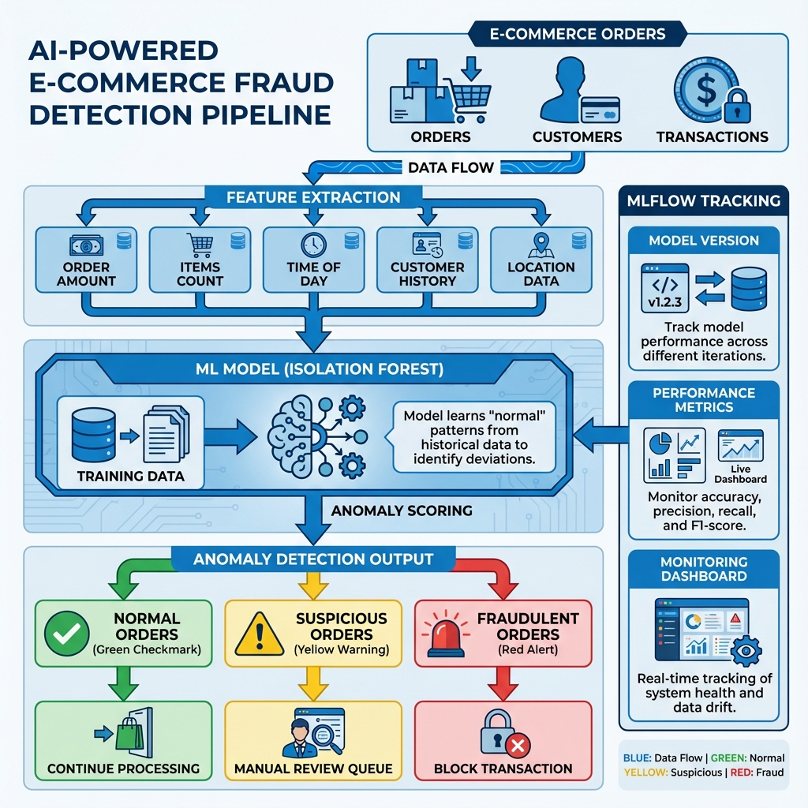
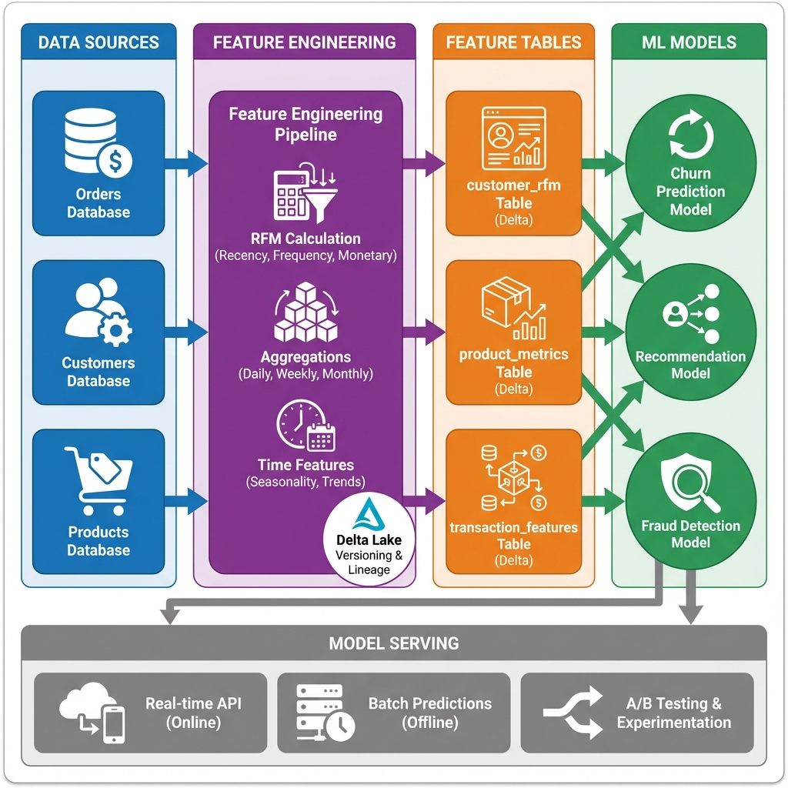
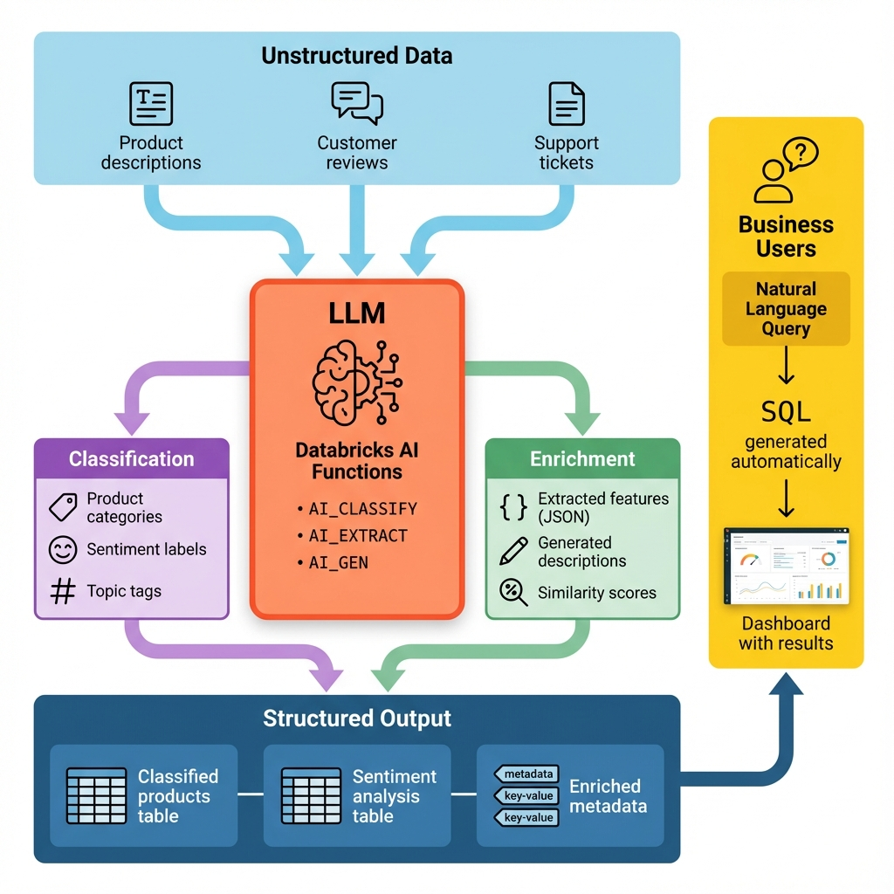

# Week 10: AI Features in Data Pipeline Engineering
**Live Session Guide**

---

## 📚 Session Overview

**Prerequisites:** Weeks 1-9 (especially Week 7: CDC, Week 8: Data Warehousing, Week 9: Security)

---

## 🎯 Learning Objectives

By the end of this session, you will be able to:

1. **Implement ML-based anomaly detection** for fraud detection in e-commerce
2. **Build feature engineering pipelines** with Delta tables
3. **Integrate LLMs** for data classification and enrichment
4. **Deploy ML models** using MLflow for production use
5. **Create AI-powered data quality** checks and monitoring

---

## 🏢 Business Problem

**Company:** ShopFast E-Commerce  
**Challenge:** Leverage AI to improve data quality, predict customer behavior, and automate data processing

**Current Pain Points:**
- Manual fraud detection is slow and misses patterns
- No predictive analytics for customer churn
- Product categorization requires manual effort
- Data quality issues discovered too late

**AI Solution:**
- Automated fraud detection using ML
- Predictive models for customer insights
- LLM-powered data enrichment
- Proactive data quality monitoring

---

## Part 1: Introduction

### Why AI in Data Pipelines?

**Traditional Data Engineering:**
```
Data → Transform → Store → Analyze
```

**AI-Enhanced Data Engineering:**
```
Data → AI Quality Check → Transform → AI Enrichment → Store → AI Analytics
```

**Benefits:**
- **Automated Quality:** ML detects anomalies humans miss
- **Predictive Insights:** Forecast trends before they happen
- **Smart Processing:** LLMs understand and classify data
- **Proactive Alerts:** AI predicts issues before they occur

---

## Part 2: Three Core AI Capabilities

### Concept 1: AI-Powered Data Quality & Anomaly Detection

**Simple Definition:**  
Use machine learning to automatically detect unusual patterns in your data that might indicate fraud, errors, or quality issues.

**Real-World Analogy:**  
Like a security guard who learns what "normal" looks like and alerts you when something suspicious happens.

**Live Demo Code:**

```python
# Databricks Notebook
from sklearn.ensemble import IsolationForest
import mlflow

# Load e-commerce orders
orders_df = spark.table("academy.silver.orders")

# Prepare features for anomaly detection
features = orders_df.select(
    "order_amount",
    "items_count",
    "hour_of_day",
    "customer_lifetime_orders"
).toPandas()

# Train anomaly detection model
model = IsolationForest(contamination=0.01, random_state=42)
model.fit(features)

# Detect anomalies
orders_df['anomaly_score'] = model.decision_function(features)
orders_df['is_anomaly'] = model.predict(features)

# Flag suspicious orders
fraud_orders = orders_df[orders_df['is_anomaly'] == -1]
print(f"Detected {len(fraud_orders)} potentially fraudulent orders")

# Log model with MLflow
mlflow.sklearn.log_model(model, "fraud_detection_model")
```

**Key Takeaways:**
- ✅ Isolation Forest detects outliers without labeled data
- ✅ Works on multiple features simultaneously
- ✅ Can run in real-time on streaming data
- ✅ MLflow tracks model versions

**Visual Explanation:**  


---

### Concept 2: Predictive Analytics & ML Feature Engineering

**Simple Definition:**  
Create reusable features from raw data that ML models can use to make predictions about customer behavior.

**Real-World Analogy:**  
Like creating a customer profile card with key stats (purchase frequency, average spend, favorite categories) that helps predict if they'll buy again.

**Live Demo Code:**

```python
# Create customer features for churn prediction
# Note: Using Delta tables (works in Community Edition)

# Feature engineering
customer_features = spark.sql("""
    SELECT 
        customer_id,
        -- Recency: Days since last order
        DATEDIFF(CURRENT_DATE(), MAX(order_date)) as days_since_last_order,
        
        -- Frequency: Number of orders
        COUNT(DISTINCT order_id) as total_orders,
        
        -- Monetary: Total spend
        SUM(order_amount) as total_spent,
        AVG(order_amount) as avg_order_value,
        
        -- Engagement
        COUNT(DISTINCT DATE(order_date)) as active_days,
        
        -- Product diversity
        COUNT(DISTINCT category) as categories_purchased,
        
        -- Churn indicator (no order in 90 days)
        CASE WHEN DATEDIFF(CURRENT_DATE(), MAX(order_date)) > 90 
             THEN 1 ELSE 0 END as churned
    FROM academy.silver.orders
    GROUP BY customer_id
""")

# Save as Delta table
customer_features.write.mode("overwrite").saveAsTable("academy.features.customer_rfm")

# Train churn prediction model
from sklearn.ensemble import RandomForestClassifier

X = customer_features.drop("customer_id", "churned").toPandas()
y = customer_features.select("churned").toPandas()

model = RandomForestClassifier(n_estimators=100, random_state=42)
model.fit(X, y)

# Feature importance
feature_importance = pd.DataFrame({
    'feature': X.columns,
    'importance': model.feature_importances_
}).sort_values('importance', ascending=False)

print("Top features for churn prediction:")
print(feature_importance.head())
```

**Key Takeaways:**
- ✅ RFM (Recency, Frequency, Monetary) are powerful features
- ✅ Delta tables enable feature reuse across models
- ✅ Unity Catalog provides governance for features
- ✅ Feature importance shows what drives predictions

**Visual Explanation:**  


---

### Concept 3: Generative AI & LLMs in Data Pipelines

**Simple Definition:**  
Use Large Language Models to understand, classify, and enrich your data automatically.

**Real-World Analogy:**  
Like having an expert assistant who can read product descriptions and instantly categorize them, or write missing descriptions based on specifications.

**Live Demo Code:**

```python
# Use Databricks AI Functions for product classification
from pyspark.sql.functions import expr

# Classify products using AI
products_classified = spark.sql("""
    SELECT 
        product_id,
        product_name,
        product_description,
        
        -- AI-powered classification
        AI_CLASSIFY(
            product_description,
            ARRAY('Electronics', 'Clothing', 'Home & Garden', 'Sports', 'Books')
        ) as ai_category,
        
        -- Extract key features
        AI_EXTRACT(
            product_description,
            'Extract the main features as a JSON object with keys: brand, color, size, material'
        ) as extracted_features,
        
        -- Generate missing descriptions
        CASE WHEN product_description IS NULL THEN
            AI_GEN(CONCAT('Generate a product description for: ', product_name))
        ELSE product_description
        END as enhanced_description
        
    FROM academy.silver.products
""")

# Sentiment analysis on customer reviews
reviews_sentiment = spark.sql("""
    SELECT 
        review_id,
        customer_id,
        product_id,
        review_text,
        
        -- Analyze sentiment
        AI_CLASSIFY(
            review_text,
            ARRAY('Positive', 'Neutral', 'Negative')
        ) as sentiment,
        
        -- Extract key topics
        AI_EXTRACT(
            review_text,
            'Extract mentioned issues or praises as a list'
        ) as key_topics
        
    FROM academy.silver.reviews
""")

# Natural language to SQL for business users
def nl_to_sql(question: str) -> str:
    """Convert natural language question to SQL"""
    prompt = f"""
    Given this e-commerce database schema:
    - customers (customer_id, email, name, city, state)
    - orders (order_id, customer_id, order_date, order_amount)
    - products (product_id, product_name, category, price)
    
    Convert this question to SQL:
    "{question}"
    
    Return only the SQL query.
    """
    
    sql_query = spark.sql(f"SELECT AI_QUERY('{prompt}')").collect()[0][0]
    return sql_query

# Example usage
question = "What are the top 5 customers by total spend this year?"
sql = nl_to_sql(question)
print(f"Generated SQL:\n{sql}")
result = spark.sql(sql)
result.show()
```

**Key Takeaways:**
- ✅ AI_CLASSIFY() categorizes data without training
- ✅ AI_EXTRACT() pulls structured data from text
- ✅ AI_GEN() generates missing content
- ✅ Natural language interfaces democratize data access

**Visual Explanation:**  


---

## Part 3: Implementation Guide

### Step-by-Step: Building an AI-Enhanced Data Pipeline

#### Step 1: Setup ML Environment

```python
# Install required libraries
%pip install mlflow scikit-learn xgboost

# Import libraries
import mlflow
from databricks.feature_store import FeatureStoreClient
from pyspark.sql.functions import col, expr
```

#### Step 2: Create Anomaly Detection Pipeline

```python
# 1. Load data
orders = spark.table("academy.silver.orders")

# 2. Feature engineering for anomaly detection
anomaly_features = orders.select(
    "order_id",
    "order_amount",
    "items_count",
    hour("order_timestamp").alias("hour"),
    dayofweek("order_timestamp").alias("day_of_week"),
    "customer_lifetime_value"
)

# 3. Train model
from sklearn.ensemble import IsolationForest
model = IsolationForest(contamination=0.01)
model.fit(anomaly_features.toPandas())

# 4. Score orders
scores = model.decision_function(anomaly_features.toPandas())
anomaly_features['anomaly_score'] = scores

# 5. Create alerts for high-risk orders
high_risk = anomaly_features[anomaly_features['anomaly_score'] < -0.5]
```

#### Step 3: Build Feature Store

```python
fs = FeatureStoreClient()

# Create customer features
customer_features = spark.sql("""
    SELECT 
        customer_id,
        COUNT(*) as order_count,
        SUM(order_amount) as total_spent,
        AVG(order_amount) as avg_order,
        MAX(order_date) as last_order_date,
        DATEDIFF(CURRENT_DATE(), MAX(order_date)) as days_since_last_order
    FROM academy.silver.orders
    GROUP BY customer_id
""")

# Register in Feature Store
fs.create_table(
    name="academy.features.customer_metrics",
    primary_keys=["customer_id"],
    df=customer_features
)
```

#### Step 4: Deploy ML Model

```python
# Register model in MLflow
with mlflow.start_run():
    mlflow.sklearn.log_model(model, "fraud_detector")
    mlflow.log_metric("contamination", 0.01)
    
# Register for production
model_uri = f"runs:/{mlflow.active_run().info.run_id}/fraud_detector"
mlflow.register_model(model_uri, "fraud_detection_prod")
```

---

## Part 4: Best Practices

### DO's ✅

1. **Version Everything**
   - Use MLflow for model versioning
   - Track feature definitions in Unity Catalog
   - Version training data with Delta Lake

2. **Monitor Model Performance**
   - Track prediction accuracy over time
   - Set up alerts for model drift
   - Retrain models regularly

3. **Secure AI Models**
   - Apply RBAC to feature stores
   - Encrypt model artifacts
   - Audit AI predictions

4. **Start Simple**
   - Begin with basic models (Isolation Forest, Random Forest)
   - Add complexity only when needed
   - Validate with business users

### DON'Ts ❌

1. **Don't Skip Data Quality**
   - Garbage in = garbage out
   - Validate features before training
   - Monitor data drift

2. **Don't Ignore Bias**
   - Check for demographic bias
   - Validate fairness metrics
   - Document model limitations

3. **Don't Over-Engineer**
   - Simple models often work best
   - Complex models are harder to maintain
   - Explainability matters

4. **Don't Forget Costs**
   - LLM API calls can be expensive
   - Monitor compute costs
   - Use batch processing when possible

---

## Part 5: Common Mistakes to Avoid

### Mistake 1: Training on Imbalanced Data
**Problem:** Fraud is rare (1%), model predicts "not fraud" for everything  
**Solution:** Use techniques like SMOTE, class weights, or anomaly detection

### Mistake 2: Data Leakage
**Problem:** Using future data to predict the past  
**Solution:** Strict train/test split, time-based validation

### Mistake 3: Not Monitoring Production Models
**Problem:** Model accuracy degrades over time  
**Solution:** Set up monitoring dashboards, retrain regularly

### Mistake 4: Ignoring Feature Engineering
**Problem:** Feeding raw data to models  
**Solution:** Create meaningful features (RFM, aggregations, ratios)

---

## Part 6: Putting It All Together

### Complete AI-Enhanced E-Commerce Pipeline

```python
# 1. Anomaly Detection Layer
def detect_fraud(orders_df):
    model = mlflow.sklearn.load_model("models:/fraud_detection_prod/Production")
    features = extract_features(orders_df)
    predictions = model.predict(features)
    return orders_df.withColumn("is_fraud", predictions)

# 2. Feature Engineering Layer
def enrich_with_features(customers_df):
    fs = FeatureStoreClient()
    features = fs.read_table("academy.features.customer_metrics")
    return customers_df.join(features, "customer_id")

# 3. LLM Enrichment Layer
def classify_products(products_df):
    return products_df.withColumn(
        "ai_category",
        expr("AI_CLASSIFY(product_description, ARRAY('Electronics', 'Clothing', 'Home'))")
    )

# 4. Complete Pipeline
def ai_enhanced_pipeline():
    # Load data
    orders = spark.table("academy.silver.orders")
    customers = spark.table("academy.silver.customers")
    products = spark.table("academy.silver.products")
    
    # Apply AI layers
    orders_checked = detect_fraud(orders)
    customers_enriched = enrich_with_features(customers)
    products_classified = classify_products(products)
    
    # Save to gold layer
    orders_checked.write.mode("overwrite").saveAsTable("academy.gold.orders_ai")
    customers_enriched.write.mode("overwrite").saveAsTable("academy.gold.customers_ai")
    products_classified.write.mode("overwrite").saveAsTable("academy.gold.products_ai")
```

---

## 🎯 Key Takeaways

1. **AI enhances every stage** of data pipelines - quality, transformation, analytics
2. **Start with simple models** - Isolation Forest, Random Forest, basic LLMs
3. **Feature engineering is critical** - Good features > complex models
4. **Monitor everything** - Model drift, data quality, prediction accuracy
5. **Security matters** - Apply Week 9 concepts to AI models
6. **LLMs are powerful** - But use them wisely (cost, latency, accuracy)

---

## 📚 Additional Resources

- [Databricks ML Documentation](https://docs.databricks.com/machine-learning/index.html)
- [MLflow Guide](https://mlflow.org/docs/latest/index.html)
- [Feature Store Best Practices](https://docs.databricks.com/machine-learning/feature-store/index.html)
- [Databricks AI Functions](https://docs.databricks.com/sql/language-manual/functions/ai_query.html)

---

## 🎓 Next Steps

1. Complete the live demo notebook
2. Practice with your own e-commerce data
3. Experiment with different ML models
4. Try Databricks AI Functions
5. Build your own AI-enhanced pipeline

---

*Clogenai Academy – Data Pipeline Engineering Track*  
*Week 10: AI Features in Data Pipeline Engineering*  
*Version 1.0 – December 2024*
