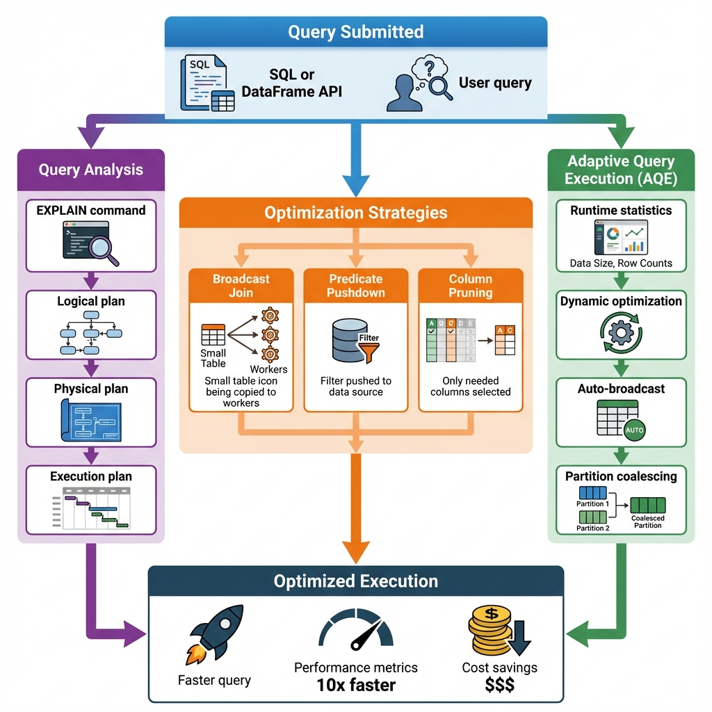
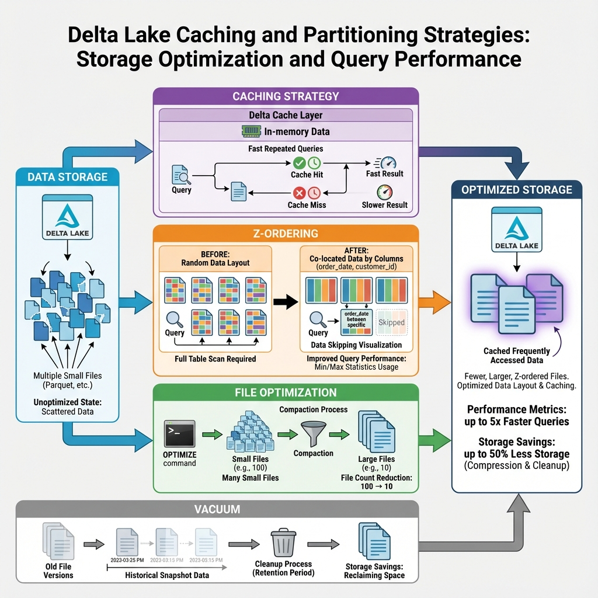
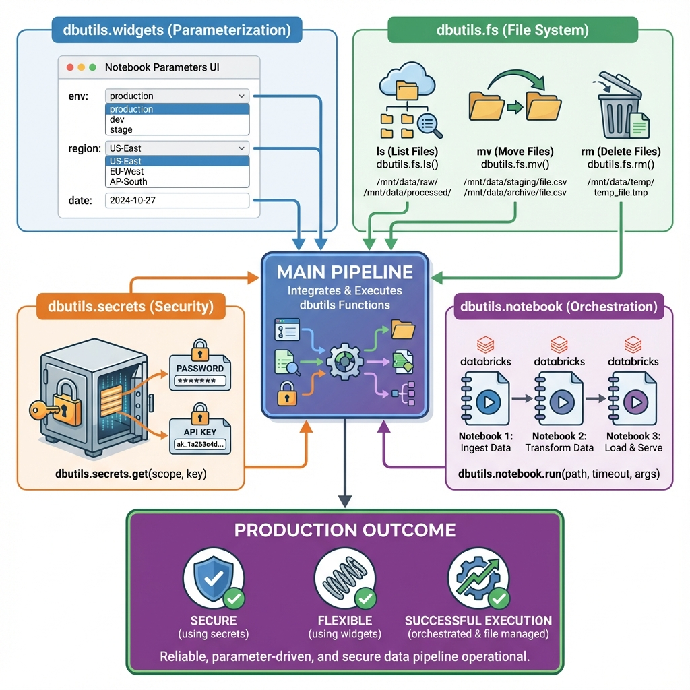

# Week 11: Advanced Performance Optimization & Databricks Utilities
**Live Session Guide**

---

## 📚 Session Overview

**Prerequisites:** Weeks 1-10 (especially Week 7: CDC, Week 8: Data Warehousing, Week 10: AI Features)

---

## 🎯 Learning Objectives

By the end of this session, you will be able to:

1. **Analyze query execution plans** and identify performance bottlenecks
2. **Optimize joins** using broadcast and partitioning strategies
3. **Implement caching** for frequently accessed data
4. **Apply Z-ordering** to improve query performance
5. **Use dbutils** for file operations, secrets, and workflows
6. **Create parameterized notebooks** for production pipelines
7. **Measure performance improvements** quantitatively

---

## 🏢 Business Problem

**Company:** ShopFast E-Commerce  
**Challenge:** Queries are slow, costs are high, pipelines need production-ready features

**Current Pain Points:**
- Dashboard queries take 5+ minutes
- Daily reports timeout
- High cloud compute costs
- Manual parameter changes for different environments

**Optimization Solution:**
- Optimize slow queries (10x faster)
- Implement caching and Z-ordering
- Reduce costs by 50%
- Parameterize notebooks for reusability

---

## Part 1: Introduction

### Why Performance Optimization Matters

**Impact:**
- **Speed:** Faster queries = happier users
- **Cost:** Optimized queries = lower cloud bills
- **Scale:** Efficient pipelines handle more data

**Real Numbers:**
```
Before optimization: 5 minutes, $50/day
After optimization: 30 seconds, $25/day
Savings: 10x faster, 50% cost reduction
```

---

## Part 2: Query Optimization & Performance Tuning

### Concept 1: Understanding Query Execution Plans

**Simple Definition:**  
A query execution plan shows how Spark will process your query - what operations, in what order, and how data moves.

**Real-World Analogy:**  
Like a recipe that shows all the steps to make a dish, including which ingredients to prep first.

**Live Demo Code:**

```python
# Databricks Notebook
from pyspark.sql.functions import *

# Load e-commerce data
orders = spark.table("academy.silver.orders")
customers = spark.table("academy.silver.customers")

# Slow query - let's analyze it
slow_query = orders.join(customers, "customer_id") \
    .groupBy("city") \
    .agg(sum("order_amount").alias("total_sales"))

# View execution plan
slow_query.explain(mode="formatted")

# Key things to look for:
# - Shuffle operations (expensive!)
# - Full table scans
# - Join strategies
```

**Key Takeaways:**
- ✅ EXPLAIN shows the query plan
- ✅ Look for shuffle operations (data movement)
- ✅ Identify full table scans
- ✅ Check join strategies

**Visual Explanation:**  


---

### Concept 2: Broadcast Joins for Small Tables

**Simple Definition:**  
When joining a large table with a small table, broadcast the small table to all workers to avoid shuffling the large table.

**Real-World Analogy:**  
Instead of moving everyone to one room, give everyone a copy of a small handout.

**Live Demo Code:**

```python
from pyspark.sql.functions import broadcast

# Small table: product categories (100 rows)
categories = spark.table("academy.silver.product_categories")

# Large table: orders (1M rows)
orders = spark.table("academy.silver.orders")

# BAD: Regular join (shuffles both tables)
slow_join = orders.join(categories, "category_id")

# GOOD: Broadcast join (only broadcasts small table)
fast_join = orders.join(broadcast(categories), "category_id")

# Compare execution times
import time

start = time.time()
slow_join.count()
slow_time = time.time() - start

start = time.time()
fast_join.count()
fast_time = time.time() - start

print(f"Regular join: {slow_time:.2f}s")
print(f"Broadcast join: {fast_time:.2f}s")
print(f"Speedup: {slow_time/fast_time:.1f}x faster")
```

**Key Takeaways:**
- ✅ Use broadcast() for small tables (< 10MB)
- ✅ Avoids expensive shuffles
- ✅ Can be 5-10x faster
- ✅ Spark auto-broadcasts tables < 10MB by default

---

### Concept 3: Adaptive Query Execution (AQE)

**Simple Definition:**  
AQE automatically optimizes queries during execution based on runtime statistics.

**Live Demo Code:**

```python
# Enable AQE (enabled by default in Databricks Runtime 7.3+)
spark.conf.set("spark.sql.adaptive.enabled", "true")
spark.conf.set("spark.sql.adaptive.coalescePartitions.enabled", "true")

# AQE will automatically:
# - Convert sort-merge joins to broadcast joins
# - Optimize partition sizes
# - Skip empty partitions

# Run query - AQE optimizes automatically
result = orders.join(customers, "customer_id") \
    .groupBy("state") \
    .agg(sum("order_amount").alias("total"))

result.show()
```

**Key Takeaways:**
- ✅ AQE is enabled by default in modern Databricks
- ✅ Automatically optimizes at runtime
- ✅ No code changes needed
- ✅ Handles skewed data better

---

## Part 3: Advanced Caching & Partitioning Strategies

### Concept 1: Delta Lake Caching

**Simple Definition:**  
Cache frequently accessed data in memory for faster repeated queries.

**Live Demo Code:**

```python
# Cache a frequently accessed table
customers = spark.table("academy.silver.customers")

# Enable Delta caching
customers.cache()

# First query: reads from storage (slow)
start = time.time()
customers.filter(col("city") == "New York").count()
first_time = time.time() - start

# Second query: reads from cache (fast)
start = time.time()
customers.filter(col("city") == "Los Angeles").count()
cached_time = time.time() - start

print(f"First query (no cache): {first_time:.2f}s")
print(f"Cached query: {cached_time:.2f}s")
print(f"Speedup: {first_time/cached_time:.1f}x faster")

# Clear cache when done
customers.unpersist()
```

**Key Takeaways:**
- ✅ Use .cache() for frequently accessed data
- ✅ First query populates cache
- ✅ Subsequent queries are much faster
- ✅ Remember to unpersist() when done

---

### Concept 2: Z-Ordering for Multi-Column Queries

**Simple Definition:**  
Z-ordering co-locates related data in the same files, making queries on multiple columns faster.

**Live Demo Code:**

```python
# Common query pattern: filter by date AND customer_id
orders = spark.table("academy.silver.orders")

# Before Z-ordering
start = time.time()
orders.filter((col("order_date") == "2024-01-15") & 
              (col("customer_id") == "CUST001")).count()
before_time = time.time() - start

# Apply Z-ordering
spark.sql("""
    OPTIMIZE academy.silver.orders
    ZORDER BY (order_date, customer_id)
""")

# After Z-ordering (data is co-located)
start = time.time()
orders.filter((col("order_date") == "2024-01-15") & 
              (col("customer_id") == "CUST001")).count()
after_time = time.time() - start

print(f"Before Z-order: {before_time:.2f}s")
print(f"After Z-order: {after_time:.2f}s")
print(f"Speedup: {before_time/after_time:.1f}x faster")
```

**Key Takeaways:**
- ✅ Z-order by columns you filter on together
- ✅ Improves data skipping
- ✅ Best for 2-4 columns
- ✅ Run OPTIMIZE regularly

**Visual Explanation:**  


---

### Concept 3: OPTIMIZE and VACUUM

**Simple Definition:**  
OPTIMIZE compacts small files into larger ones. VACUUM removes old file versions to save storage.

**Live Demo Code:**

```python
# Check current file count
file_count_before = spark.sql("""
    DESCRIBE DETAIL academy.silver.orders
""").select("numFiles").collect()[0][0]

# Compact small files
spark.sql("OPTIMIZE academy.silver.orders")

file_count_after = spark.sql("""
    DESCRIBE DETAIL academy.silver.orders
""").select("numFiles").collect()[0][0]

print(f"Files before: {file_count_before}")
print(f"Files after: {file_count_after}")
print(f"Reduction: {(1 - file_count_after/file_count_before)*100:.1f}%")

# Remove old versions (older than 7 days)
spark.sql("VACUUM academy.silver.orders RETAIN 168 HOURS")
```

**Key Takeaways:**
- ✅ OPTIMIZE reduces small files
- ✅ Fewer files = faster queries
- ✅ VACUUM saves storage costs
- ✅ Run weekly or monthly

---

## Part 4: Databricks Utilities (dbutils)

### Concept 1: File Operations with dbutils.fs

**Simple Definition:**  
dbutils.fs provides file system operations like list, copy, move, and delete.

**Live Demo Code:**

```python
# List files in a directory
files = dbutils.fs.ls("/mnt/data/raw/")
for file in files:
    print(f"{file.name}: {file.size} bytes")

# Copy files
dbutils.fs.cp("/mnt/data/raw/orders.csv", 
              "/mnt/data/archive/orders_backup.csv")

# Move files
dbutils.fs.mv("/mnt/data/raw/processed.csv", 
              "/mnt/data/processed/")

# Delete files
dbutils.fs.rm("/mnt/data/temp/", recurse=True)

# Check if file exists
if dbutils.fs.ls("/mnt/data/raw/orders.csv"):
    print("File exists!")
```

**Key Takeaways:**
- ✅ dbutils.fs works across cloud storage
- ✅ Supports DBFS, S3, ADLS, GCS
- ✅ Use for dynamic file processing
- ✅ Handles wildcards and recursion

---

### Concept 2: Secrets Management with dbutils.secrets

**Simple Definition:**  
Store and retrieve sensitive credentials securely without hardcoding them.

**Live Demo Code:**

```python
# Retrieve secrets (never print them!)
api_key = dbutils.secrets.get(scope="production", key="api_key")
db_password = dbutils.secrets.get(scope="production", key="db_password")

# Use in connections
jdbc_url = "jdbc:postgresql://mydb.com:5432/sales"
connection_properties = {
    "user": "admin",
    "password": db_password,  # From secrets
    "driver": "org.postgresql.Driver"
}

df = spark.read.jdbc(url=jdbc_url, 
                     table="orders", 
                     properties=connection_properties)

# List available scopes
scopes = dbutils.secrets.listScopes()
for scope in scopes:
    print(f"Scope: {scope.name}")
```

**Key Takeaways:**
- ✅ Never hardcode credentials
- ✅ Use secret scopes for organization
- ✅ Secrets are encrypted
- ✅ Different scopes for dev/prod

---

### Concept 3: Parameterized Notebooks with dbutils.widgets

**Simple Definition:**  
Create interactive parameters that make notebooks reusable across environments.

**Live Demo Code:**

```python
# Create widgets for parameters
dbutils.widgets.text("environment", "dev", "Environment")
dbutils.widgets.dropdown("region", "us-east", ["us-east", "us-west", "eu"], "Region")
dbutils.widgets.text("date", "2024-01-01", "Processing Date")

# Get widget values
env = dbutils.widgets.get("environment")
region = dbutils.widgets.get("region")
process_date = dbutils.widgets.get("date")

# Use in queries
catalog = f"academy_{env}"  # academy_dev or academy_prod
table_path = f"{catalog}.silver.orders_{region}"

orders = spark.table(table_path) \
    .filter(col("order_date") == process_date)

print(f"Processing {orders.count()} orders for {region} on {process_date}")

# Remove widgets when done
dbutils.widgets.removeAll()
```

**Key Takeaways:**
- ✅ Makes notebooks reusable
- ✅ Different parameters for dev/prod
- ✅ Interactive UI in Databricks
- ✅ Can be set via API/CLI

**Visual Explanation:**  


---

### Concept 4: Notebook Workflows with dbutils.notebook

**Simple Definition:**  
Chain multiple notebooks together to create complex workflows.

**Live Demo Code:**

```python
# Main orchestration notebook

# Run data ingestion notebook
ingestion_result = dbutils.notebook.run(
    "/Workspace/pipelines/01_ingest_data",
    timeout_seconds=600,
    arguments={"date": "2024-01-01", "source": "api"}
)

print(f"Ingestion result: {ingestion_result}")

# Run transformation notebook
transform_result = dbutils.notebook.run(
    "/Workspace/pipelines/02_transform_data",
    timeout_seconds=1200,
    arguments={"date": "2024-01-01"}
)

# Run quality checks
quality_result = dbutils.notebook.run(
    "/Workspace/pipelines/03_quality_checks",
    timeout_seconds=300,
    arguments={"table": "academy.silver.orders"}
)

# Exit with status
if quality_result == "PASSED":
    dbutils.notebook.exit("SUCCESS")
else:
    dbutils.notebook.exit("FAILED")
```

**Key Takeaways:**
- ✅ Orchestrate complex pipelines
- ✅ Pass parameters between notebooks
- ✅ Handle errors and retries
- ✅ Return results to parent notebook

---

## Part 5: Best Practices

### DO's ✅

1. **Measure Before Optimizing**
   - Profile queries first
   - Identify actual bottlenecks
   - Set performance baselines

2. **Use Appropriate Strategies**
   - Broadcast for small tables
   - Z-order for multi-column filters
   - Cache for repeated queries

3. **Monitor Costs**
   - Track compute usage
   - Optimize expensive queries first
   - Use auto-scaling clusters

4. **Parameterize Everything**
   - Use widgets for environments
   - Store secrets securely
   - Make notebooks reusable

### DON'Ts ❌

1. **Don't Over-Optimize**
   - Focus on slow queries
   - 80/20 rule applies
   - Don't optimize everything

2. **Don't Cache Everything**
   - Only cache frequently accessed data
   - Caching uses memory
   - Clear cache when done

3. **Don't Ignore File Sizes**
   - Too many small files = slow
   - Run OPTIMIZE regularly
   - Monitor file counts

4. **Don't Hardcode Values**
   - Use widgets for parameters
   - Use secrets for credentials
   - Think about reusability

---

## Part 6: Putting It All Together

### Complete Optimized Pipeline

```python
# Parameterized, optimized e-commerce pipeline

# 1. Get parameters
env = dbutils.widgets.get("environment")
date = dbutils.widgets.get("date")

# 2. Load data with caching
customers = spark.table(f"academy_{env}.silver.customers").cache()
products = spark.table(f"academy_{env}.silver.products")
orders = spark.table(f"academy_{env}.silver.orders") \
    .filter(col("order_date") == date)

# 3. Optimized join (broadcast small table)
enriched_orders = orders \
    .join(broadcast(products), "product_id") \
    .join(customers, "customer_id")

# 4. Aggregation with AQE
daily_summary = enriched_orders \
    .groupBy("city", "category") \
    .agg(
        sum("order_amount").alias("total_sales"),
        count("order_id").alias("order_count"),
        countDistinct("customer_id").alias("unique_customers")
    )

# 5. Write with optimization
daily_summary.write \
    .mode("overwrite") \
    .option("optimizeWrite", "true") \
    .saveAsTable(f"academy_{env}.gold.daily_summary")

# 6. Optimize and Z-order
spark.sql(f"""
    OPTIMIZE academy_{env}.gold.daily_summary
    ZORDER BY (city, category)
""")

# 7. Clean up
customers.unpersist()

print(f"Pipeline complete for {date} in {env} environment")
```

---

## 🎯 Key Takeaways

1. **Query plans reveal bottlenecks** - Use EXPLAIN to understand
2. **Broadcast joins** save time for small tables
3. **Z-ordering** improves multi-column queries
4. **Caching** speeds up repeated access
5. **dbutils** makes notebooks production-ready
6. **Measure everything** - Before and after optimization

---

## 📚 Additional Resources

- [Spark Performance Tuning](https://spark.apache.org/docs/latest/sql-performance-tuning.html)
- [Delta Lake Optimization](https://docs.delta.io/latest/optimizations-oss.html)
- [Databricks dbutils](https://docs.databricks.com/dev-tools/databricks-utils.html)
- [Z-Ordering Guide](https://docs.databricks.com/delta/data-skipping.html)

---

*Clogenai Academy – Data Pipeline Engineering Track*  
*Week 11: Advanced Performance Optimization & Databricks Utilities*  
*Version 1.0 – December 2024*
