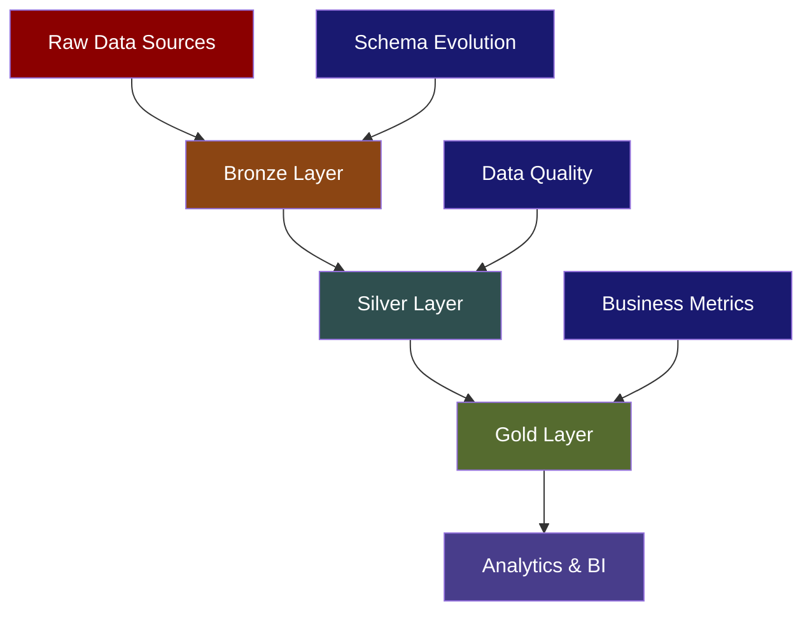
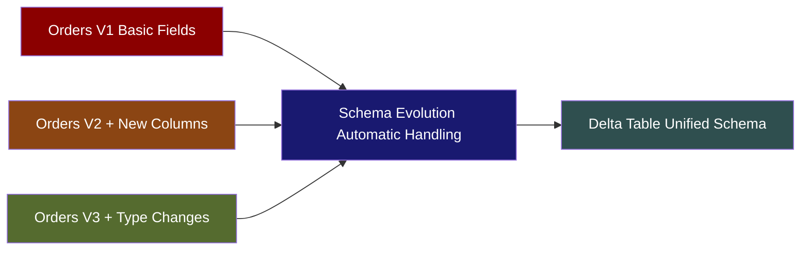
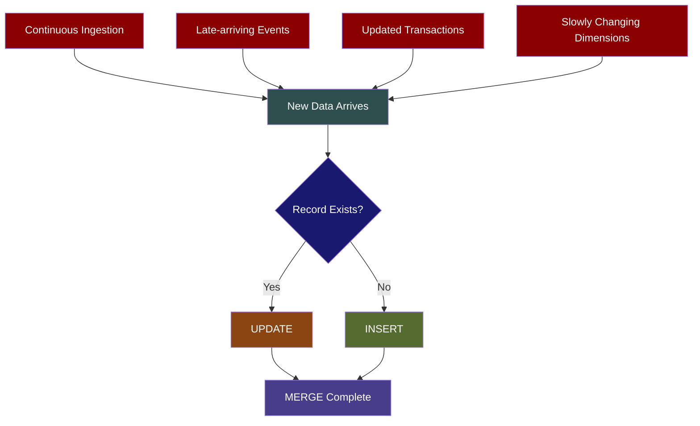
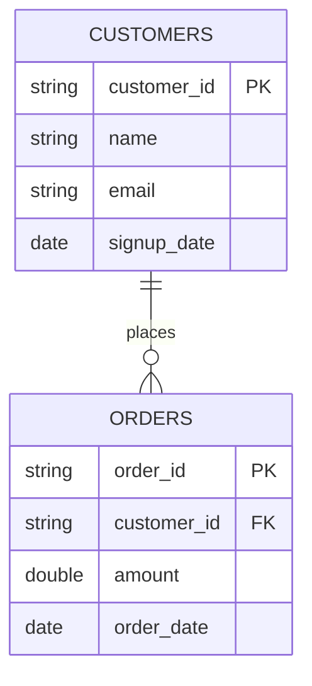
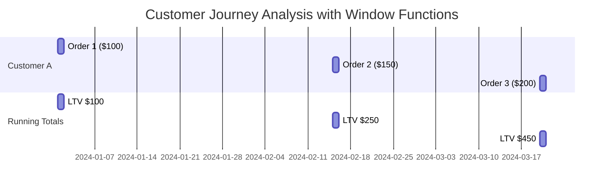
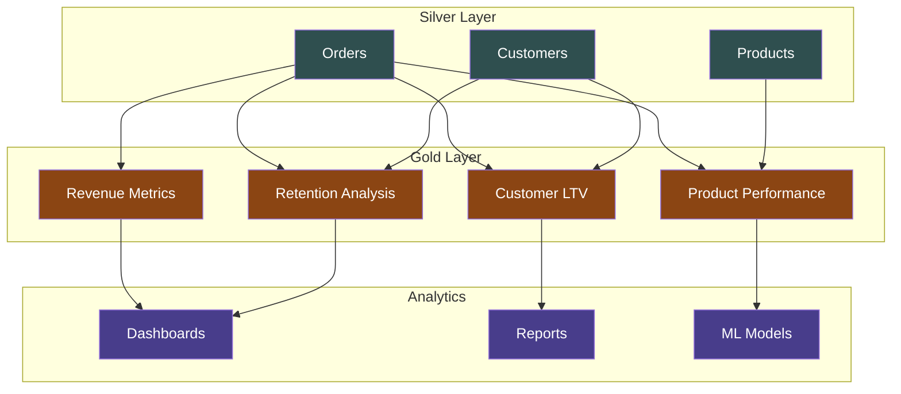
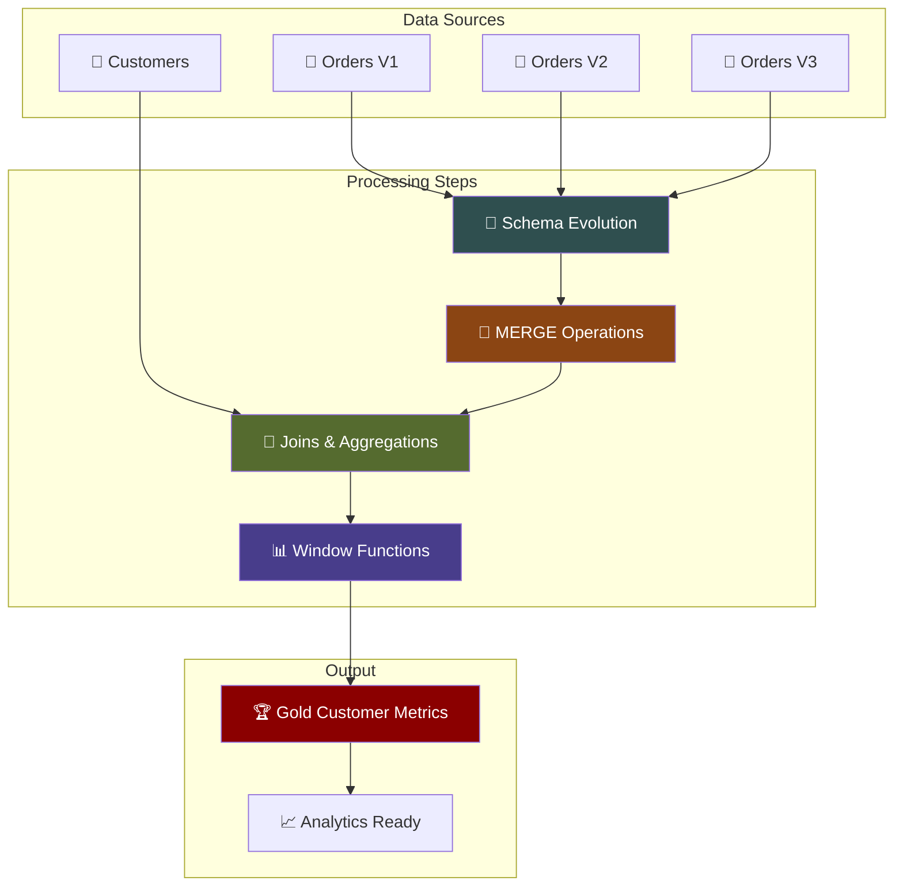
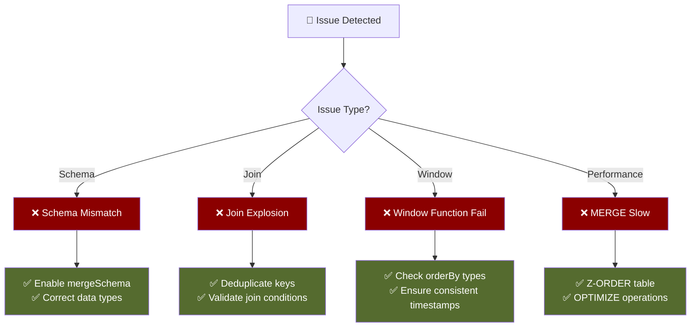

# Week 4 – PySpark Transformations & Modeling



**Medallion Architecture Flow:**
```
┌─────────────────┐    ┌─────────────────┐    ┌─────────────────┐    ┌─────────────────┐    ┌─────────────────┐
│  Raw Data       │───▶│  Bronze Layer   │───▶│  Silver Layer   │───▶│   Gold Layer    │───▶│  Analytics &    │
│  Sources        │    │  (Raw Ingestion)│    │ (Clean & Valid) │    │(Business Ready) │    │      BI         │
└─────────────────┘    └─────────────────┘    └─────────────────┘    └─────────────────┘    └─────────────────┘
                              ▲                        ▲                        ▲
                              │                        │                        │
                       ┌─────────────┐        ┌─────────────┐        ┌─────────────┐
                       │   Schema    │        │    Data     │        │  Business   │
                       │  Evolution  │        │   Quality   │        │   Metrics   │
                       └─────────────┘        └─────────────┘        └─────────────┘
```

## Learning Objectives
By the end of this session, you will:
- 🔄 Apply schema evolution and enforcement with Delta Lake
- 🚀 Build incremental pipelines using MERGE and timestamp-based logic
- 📊 Use joins, aggregations, and window functions for analytical metrics
- 🏆 Create Gold-layer tables for revenue, retention, and customer metrics
- 🤖 Use Databricks AI to define schemas and generate PySpark + SQL DDL
- ✅ Validate business-friendly analytical models in Databricks

---

## 1. Schema Evolution, Enforcement & Incremental Delta Processing

### Why Schema Evolution Matters  
Modern data systems receive changing datasets: new columns, modified types, updated structures.



**Schema Evolution Process:**
```
┌─────────────┐
│  Orders V1  │────┐
│ Basic Fields│    │    ┌──────────────────┐    ┌─────────────────┐
└─────────────┘    ├───▶│ Schema Evolution │───▶│   Delta Table   │
┌─────────────┐    │    │ Auto Handling    │    │ Unified Schema  │
│  Orders V2  │────┤    └──────────────────┘    └─────────────────┘
│+ New Columns│    │
└─────────────┘    │
┌─────────────┐    │
│  Orders V3  │────┘
│+Type Changes│
└─────────────┘
```

Delta Lake's schema evolution + enforcement ensures:

- ✅ Reliable ingestion even when schemas shift  
- 🛡️ Protection against invalid/incorrect data  
- 🔧 Ability to process changing feeds without rebuilding pipelines  

### Example: Basic Schema Change Detection  
```python
df1 = spark.table("bronze.orders_v1")
df2 = spark.table("bronze.orders_v2")

df1.printSchema()
df2.printSchema()
```

### Enabling Schema Evolution  
```python
df2.write.format("delta") \
    .option("mergeSchema", "true") \
    .mode("append") \
    .saveAsTable("silver.orders")
```

### Delta Table History  
```python
from delta.tables import DeltaTable

delta_tbl = DeltaTable.forName(spark, "silver.orders")
delta_tbl.history().show()
```

---

## 2. Incremental Data Processing & MERGE Operations

### When to Use Incremental Pipelines



**Use Cases:**
- 🔄 Continuous ingestion  
- ⏰ Late-arriving events  
- 💼 Updated business transactions  
- 📊 Slowly changing dimensions  

### Typical Incremental MERGE Pattern
```python
incremental_df = spark.table("bronze.orders_incremental")
delta_tbl = DeltaTable.forName(spark, "silver.orders")

delta_tbl.alias("t").merge(
    incremental_df.alias("s"),
    "t.order_id = s.order_id"
).whenMatchedUpdateAll() \
 .whenNotMatchedInsertAll() \
 .execute()
```

### Key Advantages
- Updates and inserts in one operation  
- ACID guarantees  
- No duplication  
- No full table rewrite needed  

---

## 3. Joins, Aggregations & Window Functions

### Data Relationship Visualization



### Joining Customer and Order Data  
```python
orders = spark.table("silver.orders")
customers = spark.table("silver.customers")

joined = orders.join(customers, "customer_id", "left")
```

### Aggregations for Metrics  
```python
from pyspark.sql.functions import sum, avg, count

metrics = orders.groupBy("customer_id").agg(
    sum("amount").alias("total_revenue"),
    count("*").alias("order_count"),
    avg("amount").alias("avg_order_value")
)
```

### Window Functions  
Powerful for retention, running totals, LTV, and ordering.



```python
from pyspark.sql.window import Window
from pyspark.sql.functions import lag, sum

w = Window.partitionBy("customer_id").orderBy("order_date")

df = orders.withColumn("prev_order", lag("order_date").over(w)) \
           .withColumn("lifetime_spend", sum("amount").over(w))
```

---

## 4. Designing Gold-Layer Tables for Analytics

### Gold Layer Architecture



### Why Gold Tables Exist
Gold tables serve business stakeholders:

- 💰 Revenue metrics  
- 🔄 Retention indicators  
- 📊 Customer activity signals  
- 📈 Aggregates and KPIs  
- 🎯 Dashboard-ready structures  

### Example: Gold Schema Definition (AI-assisted)
```sql
CREATE TABLE gold.customer_metrics (
    customer_id STRING,
    total_revenue DOUBLE,
    avg_order_value DOUBLE,
    order_count INT,
    lifetime_value DOUBLE,
    retention_flag BOOLEAN,
    first_order_date DATE,
    latest_order_date DATE
) USING DELTA;
```

### Writing the Gold Table  
```python
metrics.write.mode("overwrite").saveAsTable("gold.customer_metrics")
```

---

## 5. Using Databricks AI for Schema & DDL Generation

### How to Use AI in This Step
Ask Databricks AI to:

- Infer the ideal schema from sample data  
- Suggest column names, types, and constraints  
- Generate PySpark code or SQL DDL  
- Validate column-level definitions  
- Explain best practices for modeling  

### Example Prompt  
```
"Generate a Delta Lake table schema for customer revenue metrics.
Include customer_id, total_revenue, retention_flag, and running LTV."
```

### Example AI-Generated PySpark DDL
```python
ddl = """
CREATE TABLE gold.customer_metrics (
  customer_id STRING,
  total_revenue DOUBLE,
  avg_order_value DOUBLE,
  lifetime_value DOUBLE,
  retention_flag BOOLEAN
)
USING DELTA;
"""
spark.sql(ddl)
```

---

## 6. Gold Table Example: Revenue & Retention

### From Silver to Gold  
```python
from pyspark.sql.functions import sum, count, avg, min, max

gold = joined_df.groupBy("customer_id").agg(
    sum("amount").alias("total_revenue"),
    avg("amount").alias("avg_order_value"),
    count("*").alias("order_count"),
    min("order_date").alias("first_order_date"),
    max("order_date").alias("latest_order_date")
)
```

---

## 7. Incremental Customer Metrics Pipeline

### 🎯 Pipeline Architecture Overview



### 🎯 Pipeline
Build a pipeline that:

1. 🔄 Handles schema evolution on multiple versions of an orders feed  
2. 🚀 Processes incremental updates using MERGE  
3. 📊 Produces customer metrics using joins, aggregations & window functions  
4. 🏆 Stores results in a Gold Delta table  
5. 🤖 Uses Databricks AI to define schema + generate DDL  

---

## 8. Troubleshooting Guide

### Common Issues & Solutions



### Common Issues & Fixes

#### ❌ Schema mismatch  
```
Error: Cannot write incompatible data to column
```
**Fix**: Enable mergeSchema or correct types before write.

#### ❌ Many-to-many join explosion  
**Fix**: Deduplicate keys or validate join keys before joining.

#### ❌ Window functions fail  
**Fix**: Ensure orderBy uses a consistent type (date, timestamp).

#### ❌ MERGE slow  
**Fix**: Z-ORDER and OPTIMIZE the table.

---

## 9. Key Takeaways & Success Criteria


### What You Should Understand
- 🔄 Delta's schema evolution enables flexibility  
- 💰 Incremental pipelines reduce compute costs  
- 📊 Joins + aggregations + windows create analytical signals  
- 🏆 Gold tables provide consistent business metrics  
- 🤖 AI speeds up schema design & DDL creation  

### Your Notebook Must Include
- ✅ Working schema evolution demo  
- ✅ MERGE incremental logic  
- ✅ Customer metrics (revenue, order count, LTV)  
- ✅ Gold table creation + preview  
- ✅ Reflection on learnings  

---

## 10. What You'll Practice This Week


**Practice Areas:**
- 🔄 Schema changes across versions  
- 🚀 Incremental logic with MERGE  
- 📊 Analytical metrics with window functions  
- 🏆 Designing Gold models  
- 🤖 Using AI for schema generation  
- 📝 Writing high-quality documentation  

---

## Q&A  
Ask questions – Clarify concepts – Prepare for Week 4