# Week 5 – Data Quality & Validation

## Learning Objectives
By the end of this session, you will:
- 🔍 Identify data quality dimensions and common issues in datasets
- 📋 Design validation rules using schema enforcement and rule-based approaches
- 🎯 Implement Great Expectations Core for declarative validation
- 🛡️ Apply Delta constraints and PySpark validation logic
- 📊 Set up data quality monitoring and profiling dashboards
- ✅ Build robust data quality pipelines with automated validation

---


**Data Quality Pipeline Flow:**
```
┌─────────────────┐    ┌─────────────────┐    ┌─────────────────┐    ┌─────────────────┐    ┌─────────────────┐
│  Raw Data       │───▶│  Schema Check   │───▶│  Rule Validation│───▶│  Clean Storage  │───▶│  Analytics &    │
│  Sources        │    │  & Profiling    │    │  & Monitoring   │    │ w/ Constraints  │    │      BI         │
└─────────────────┘    └─────────────────┘    └─────────────────┘    └─────────────────┘    └─────────────────┘
                              ▲                        ▲                        ▲
                              │                        │                        │
                       ┌─────────────┐        ┌─────────────┐        ┌─────────────┐
                       │   Schema    │        │ Great       │        │   Delta     │
                       │ Enforcement │        │Expectations │        │ Constraints │
                       └─────────────┘        └─────────────┘        └─────────────┘
```

---

## 1. Data Quality Dimensions & Issue Identification

### Why Data Quality Matters  
Poor data quality leads to incorrect analytics, failed ML models, and bad business decisions.

```mermaid
flowchart LR
    A["📊 Raw Dataset"] --> B["🔍 Quality Assessment"]
    B --> C["❌ Issues Found"]
    B --> D["✅ Clean Data"]
    C --> E["🔧 Validation Rules"]
    E --> F["🛡️ Quality Pipeline"]
    F --> D
    
    style A fill:#8B0000,color:#fff
    style B fill:#191970,color:#fff
    style C fill:#8B4513,color:#fff
    style D fill:#556B2F,color:#fff
    style E fill:#2F4F4F,color:#fff
    style F fill:#483D8B,color:#fff
```



**Data Quality Dimensions:**
```
┌─────────────────┐
│  Completeness   │────┐
│ Missing Values  │    │    ┌──────────────────┐    ┌─────────────────┐
└─────────────────┘    ├───▶│ Quality Issues   │───▶│  Validation     │
┌─────────────────┐    │    │   Assessment     │    │    Rules        │
│   Accuracy      │────┤    └──────────────────┘    └─────────────────┘
│ Correct Values  │    │
└─────────────────┘    │
┌─────────────────┐    │
│   Validity      │────┘
│ Format & Range  │
└─────────────────┘
```

The six key data quality dimensions:

- ✅ **Completeness**: No missing or null values where required
- 🎯 **Accuracy**: Values match real-world entities  
- 📏 **Validity**: Data conforms to defined formats and ranges
- 🔑 **Uniqueness**: No duplicate records where uniqueness is required
- 🔄 **Consistency**: Values are uniform across systems and time
- ⏰ **Timeliness**: Data is current and available when needed

### Example: Quality Issue Detection  
```python
# Load and inspect dataset
df = spark.table("bronze.orders")
df.printSchema()
df.describe().show()

# Check for missing values
from pyspark.sql.functions import col, isnan, when, count
df.select([count(when(col(c).isNull(), c)).alias(c) for c in df.columns]).show()
```

### Common Quality Issues
```python
# Duplicates
df.groupBy("order_id").count().filter("count > 1").show()

# Invalid ranges
df.filter(col("amount") < 0).count()

# Format issues
df.filter(~col("email").rlike("^[a-zA-Z0-9._%+-]+@[a-zA-Z0-9.-]+\\.[a-zA-Z]{2,}$")).count()
```

---

## 2. Validation Approaches & Rule Design

### Validation Strategy Overview

```mermaid
graph TD
    A["📋 Validation Rules"] --> B{Rule Type?}
    
    B -->|Schema| C["🏗️ Schema Enforcement"]
    B -->|Business| D["📊 Rule-Based Logic"]
    B -->|Declarative| E["🎯 Great Expectations"]
    B -->|Database| F["🛡️ Delta Constraints"]
    
    C --> G["✅ Type & Structure Validation"]
    D --> H["✅ Custom Business Rules"]
    E --> I["✅ Expectation Suites"]
    F --> J["✅ Hard Constraints"]
    
    style A fill:#2F4F4F,color:#fff
    style B fill:#191970,color:#fff
    style C fill:#8B4513,color:#fff
    style D fill:#556B2F,color:#fff
    style E fill:#483D8B,color:#fff
    style F fill:#8B0000,color:#fff
```



**Validation Approaches:**
- 🏗️ **Schema Enforcement**: Type checking, required fields
- 📊 **Rule-Based Logic**: Custom PySpark validation functions
- 🎯 **Great Expectations**: Declarative expectation suites
- 🛡️ **Delta Constraints**: Database-level NOT NULL and CHECK constraints

### Schema Enforcement Example
```python
from pyspark.sql.types import StructType, StructField, StringType, DoubleType, DateType

expected_schema = StructType([
    StructField("order_id", StringType(), False),
    StructField("customer_id", StringType(), False),
    StructField("amount", DoubleType(), False),
    StructField("order_date", DateType(), False)
])

# Enforce schema on read
df = spark.read.schema(expected_schema).option("mode", "FAILFAST").parquet("path/to/data")
```

### Rule-Based Validation
```python
from pyspark.sql.functions import col, when

def validate_orders(df):
    return df.withColumn("is_valid", 
        when((col("amount") > 0) & 
             (col("order_id").isNotNull()) & 
             (col("customer_id").isNotNull()), True)
        .otherwise(False)
    )

validated_df = validate_orders(df)
invalid_count = validated_df.filter(col("is_valid") == False).count()
```

---

## 3. Great Expectations Core Implementation

### Great Expectations Workflow

```mermaid
flowchart TB
    subgraph "GE Setup"
        A1["📋 Data Context"]
        A2["🎯 Expectation Suite"]
        A3["📊 Validator"]
    end
    
    subgraph "Validation Process"
        B1["🔍 Run Expectations"]
        B2["📈 Generate Results"]
        B3["📝 Create Reports"]
    end
    
    subgraph "Actions"
        C1["✅ Pass: Continue Pipeline"]
        C2["❌ Fail: Alert & Stop"]
    end
    
    A1 --> A2
    A2 --> A3
    A3 --> B1
    B1 --> B2
    B2 --> B3
    B3 --> C1
    B3 --> C2
    
    style A1 fill:#2F4F4F,color:#fff
    style A2 fill:#8B4513,color:#fff
    style A3 fill:#556B2F,color:#fff
    style B1 fill:#483D8B,color:#fff
    style C1 fill:#556B2F,color:#fff
    style C2 fill:#8B0000,color:#fff
```



### Setting Up Great Expectations
```python
import great_expectations as gx
from great_expectations.core import ExpectationSuite

# Create data context
context = gx.get_context()

# Create expectation suite
suite = ExpectationSuite(expectation_suite_name="orders_validation")

# Add expectations
suite.add_expectation(
    gx.expectations.ExpectColumnValuesToNotBeNull(column="order_id")
)

suite.add_expectation(
    gx.expectations.ExpectColumnValuesToBeUnique(column="order_id")
)

suite.add_expectation(
    gx.expectations.ExpectColumnValuesToBeBetween(
        column="amount", 
        min_value=0, 
        max_value=10000
    )
)
```

### Running Validation
```python
# Create validator
validator = context.get_validator(
    batch_request=batch_request,
    expectation_suite=suite
)

# Run validation
results = validator.validate()

# Check results
if results.success:
    print("✅ All expectations passed!")
else:
    print("❌ Validation failed!")
    for result in results.results:
        if not result.success:
            print(f"Failed: {result.expectation_config.expectation_type}")
```

---

## 4. Delta Constraints & PySpark Validation

### Delta Constraint Types


### Implementing Delta Constraints
```python
# Create table with constraints
spark.sql("""
CREATE TABLE silver.orders (
    order_id STRING NOT NULL,
    customer_id STRING NOT NULL,
    amount DOUBLE,
    order_date DATE NOT NULL,
    status STRING,
    CONSTRAINT positive_amount CHECK (amount > 0),
    CONSTRAINT valid_status CHECK (status IN ('pending', 'completed', 'cancelled'))
) USING DELTA
""")
```

### Adding Constraints to Existing Tables
```python
# Add NOT NULL constraint
spark.sql("ALTER TABLE silver.orders ALTER COLUMN customer_id SET NOT NULL")

# Add CHECK constraint
spark.sql("ALTER TABLE silver.orders ADD CONSTRAINT positive_amount CHECK (amount > 0)")
```

### PySpark Validation Functions
```python
from pyspark.sql.functions import col, regexp_match

def comprehensive_validation(df):
    """Apply multiple validation rules"""
    return df.withColumn("validation_errors", 
        when(col("order_id").isNull(), "Missing order_id")
        .when(col("amount") <= 0, "Invalid amount")
        .when(~regexp_match(col("email"), r"^[\w\.-]+@[\w\.-]+\.\w+$"), "Invalid email")
        .otherwise("Valid")
    )

# Apply validation
validated_df = comprehensive_validation(df)
error_summary = validated_df.groupBy("validation_errors").count().show()
```

---

## 5. Data Quality Monitoring & Profiling

### Monitoring Architecture

```mermaid
flowchart TD
    subgraph "Data Sources"
        A1["📊 Orders"]
        A2["👥 Customers"]
        A3["📦 Products"]
    end
    
    subgraph "Quality Monitoring"
        B1["📈 Profiling"]
        B2["🔍 Anomaly Detection"]
        B3["📊 Quality Metrics"]
    end
    
    subgraph "Alerting"
        C1["📧 Email Alerts"]
        C2["📱 Slack Notifications"]
        C3["📋 Dashboard Updates"]
    end
    
    A1 --> B1
    A2 --> B1
    A3 --> B1
    
    B1 --> B2
    B2 --> B3
    B3 --> C1
    B3 --> C2
    B3 --> C3
    
    style B1 fill:#2F4F4F,color:#fff
    style B2 fill:#8B4513,color:#fff
    style B3 fill:#556B2F,color:#fff
    style C1 fill:#483D8B,color:#fff
```



### Setting Up Data Profiling
```python
# Enable data profiling on table
spark.sql("""
ALTER TABLE silver.orders 
SET TBLPROPERTIES (
    'delta.dataQualityMonitoring.enabled' = 'true'
)
""")

# View profiling results
spark.sql("DESCRIBE DETAIL silver.orders").show()
```

### Custom Quality Metrics
```python
def calculate_quality_metrics(df):
    """Calculate comprehensive quality metrics"""
    total_rows = df.count()
    
    metrics = {
        'total_rows': total_rows,
        'null_order_ids': df.filter(col("order_id").isNull()).count(),
        'negative_amounts': df.filter(col("amount") < 0).count(),
        'duplicate_orders': df.groupBy("order_id").count().filter("count > 1").count(),
        'completeness_rate': (total_rows - df.filter(col("order_id").isNull()).count()) / total_rows
    }
    
    return metrics

# Calculate and display metrics
quality_metrics = calculate_quality_metrics(df)
for metric, value in quality_metrics.items():
    print(f"{metric}: {value}")
```

---

## 6. Building a Complete Data Quality Pipeline

### 🎯 Pipeline Architecture Overview

```mermaid
flowchart TD
    subgraph "Input"
        A1["📄 Raw Orders"]
        A2["📄 Raw Customers"]
    end
    
    subgraph "Quality Pipeline"
        B1["🔍 Schema Validation"]
        B2["📋 Rule Validation"]
        B3["🎯 GE Expectations"]
        B4["🛡️ Delta Constraints"]
        B5["📊 Quality Monitoring"]
    end
    
    subgraph "Output"
        C1["✅ Clean Data"]
        C2["📈 Quality Reports"]
        C3["🚨 Alerts"]
    end
    
    A1 --> B1
    A2 --> B1
    B1 --> B2
    B2 --> B3
    B3 --> B4
    B4 --> B5
    
    B5 --> C1
    B5 --> C2
    B5 --> C3
    
    style B1 fill:#2F4F4F,color:#fff
    style B2 fill:#8B4513,color:#fff
    style B3 fill:#556B2F,color:#fff
    style B4 fill:#483D8B,color:#fff
    style B5 fill:#8B0000,color:#fff
```



### Complete Pipeline Implementation
```python
def data_quality_pipeline(input_df, table_name):
    """Complete data quality pipeline"""
    
    # Step 1: Schema validation
    validated_df = validate_schema(input_df)
    
    # Step 2: Business rule validation
    rule_validated_df = apply_business_rules(validated_df)
    
    # Step 3: Great Expectations validation
    ge_results = run_great_expectations(rule_validated_df)
    
    if not ge_results.success:
        raise ValueError("Great Expectations validation failed")
    
    # Step 4: Write with Delta constraints
    rule_validated_df.write \
        .format("delta") \
        .mode("append") \
        .option("mergeSchema", "true") \
        .saveAsTable(table_name)
    
    # Step 5: Generate quality report
    quality_report = generate_quality_report(rule_validated_df)
    
    return quality_report

# Run pipeline
quality_report = data_quality_pipeline(raw_df, "silver.orders_validated")
```

---

## 7. Troubleshooting Guide

### Common Issues & Solutions

```mermaid
flowchart TD
    A["🚨 Quality Issue"] --> B{Issue Type?}
    
    B -->|Schema| C["❌ Schema Mismatch"]
    B -->|Constraint| D["❌ Constraint Violation"]
    B -->|Expectation| E["❌ GE Expectation Failed"]
    B -->|Performance| F["❌ Validation Slow"]
    
    C --> C1["✅ Update schema definition<br/>✅ Enable mergeSchema"]
    D --> D1["✅ Fix data at source<br/>✅ Adjust constraints"]
    E --> E1["✅ Review expectation logic<br/>✅ Update thresholds"]
    F --> F1["✅ Optimize validation queries<br/>✅ Use sampling"]
    
    style C fill:#8B0000,color:#fff
    style D fill:#8B0000,color:#fff
    style E fill:#8B0000,color:#fff
    style F fill:#8B0000,color:#fff
    style C1 fill:#556B2F,color:#fff
    style D1 fill:#556B2F,color:#fff
    style E1 fill:#556B2F,color:#fff
    style F1 fill:#556B2F,color:#fff
```



### Common Issues & Fixes

#### ❌ Schema validation fails
```
Error: Column 'amount' expected DoubleType but found StringType
```
**Fix**: Update schema definition or cast data types before validation.

#### ❌ Delta constraint violation
```
Error: CHECK constraint 'positive_amount' violated
```
**Fix**: Clean data at source or adjust constraint logic.

#### ❌ Great Expectations timeout
**Fix**: Use data sampling for large datasets or optimize expectation queries.

#### ❌ High false positive rate
**Fix**: Review and adjust validation thresholds based on data patterns.

---

## 8. Key Takeaways & Success Criteria

### What You Should Understand
- 🔍 Data quality dimensions help categorize and prioritize issues
- 📋 Multiple validation approaches serve different use cases
- 🎯 Great Expectations provides declarative, reusable validation
- 🛡️ Delta constraints enforce hard rules at the database level
- 📊 Monitoring and profiling enable proactive quality management

### Your Notebook Must Include
- ✅ Quality issue identification and categorization
- ✅ Schema enforcement and rule-based validation
- ✅ Great Expectations expectation suite
- ✅ Delta constraints implementation
- ✅ Quality monitoring setup
- ✅ Complete validation pipeline

---

## 9. What You'll Practice This Week

**Practice Areas:**
- 🔍 Identifying quality issues across dimensions
- 📋 Designing comprehensive validation rules
- 🎯 Implementing Great Expectations suites
- 🛡️ Setting up Delta constraints
- 📊 Building quality monitoring dashboards
- 🔧 Troubleshooting validation failures

---

## Q&A  
Ask questions – Clarify concepts – Prepare for Week 5