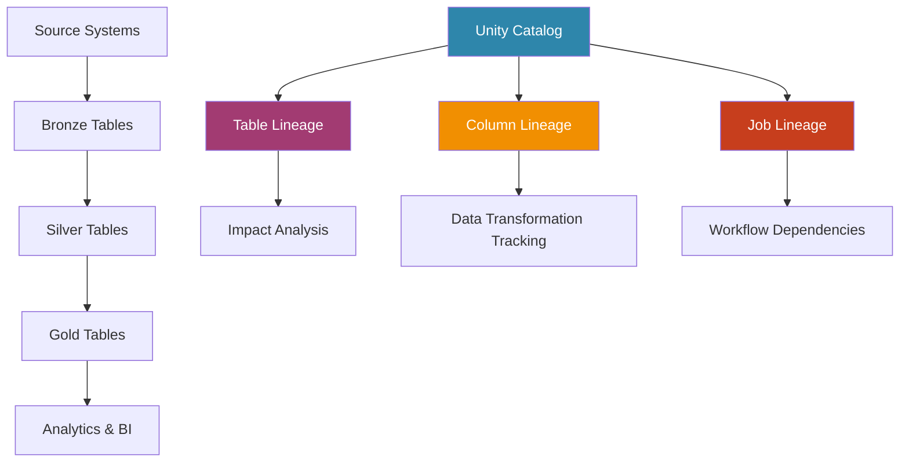
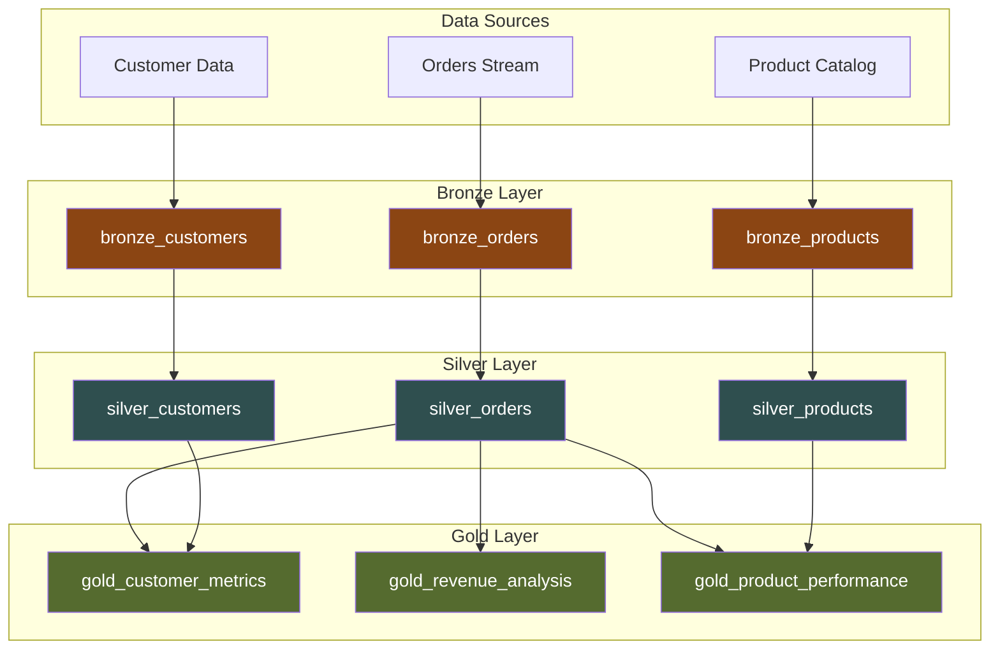
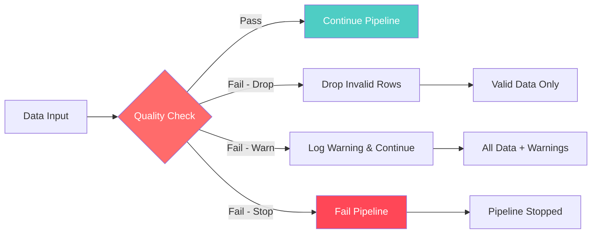
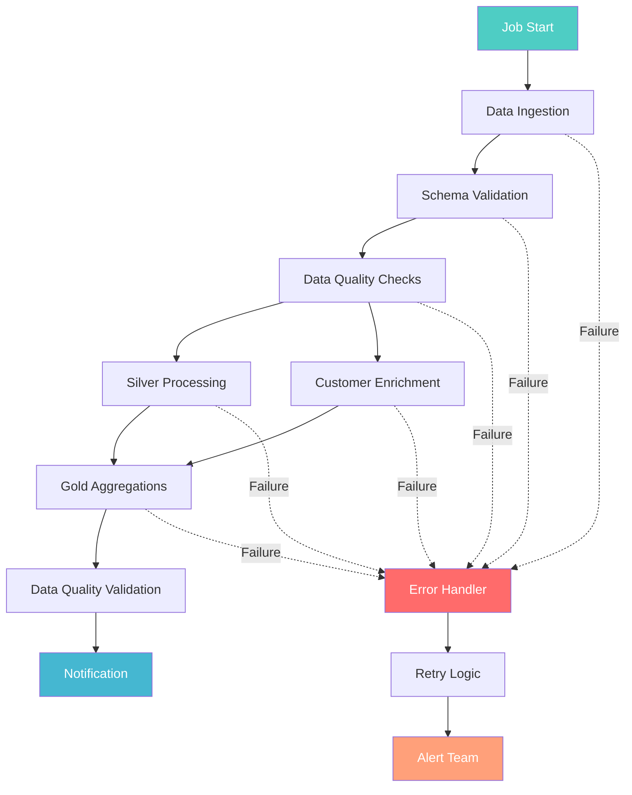
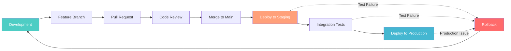
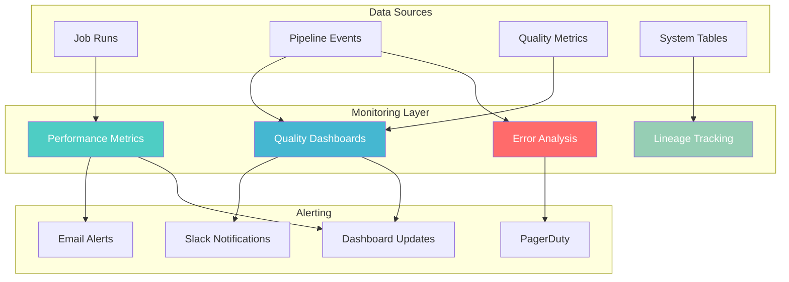
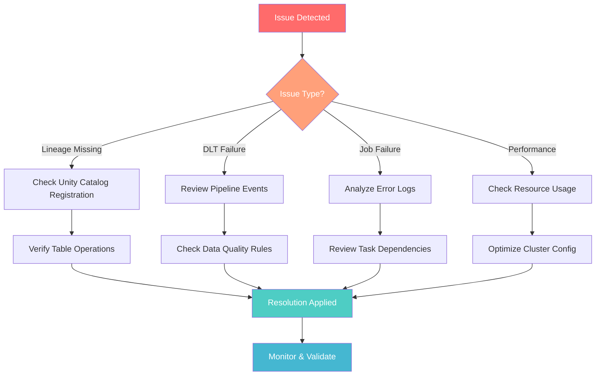

# Databricks Dataflows, Lineage & Orchestration

## Overview

This guide provides comprehensive coverage of advanced Databricks capabilities for managing enterprise data workflows. It focuses on three critical areas: Unity Catalog lineage for data governance, Delta Live Tables for declarative pipeline management, and orchestration patterns for production deployment.

## Learning Objectives
By the end of this guide, you will:
- 🔍 Master Unity Catalog lineage for end-to-end data traceability
- 🚀 Build declarative pipelines using Delta Live Tables
- 📊 Implement comprehensive data quality expectations
- 🔄 Design multi-task workflows with Databricks Jobs
- 🌐 Establish Git-based development and deployment workflows
- ✅ Apply observability best practices for production systems

---

## 1. Unity Catalog Lineage & Data Governance

### Data Lineage Flow



### Key Concepts

**Data Lineage Fundamentals**
Unity Catalog automatically captures lineage information from:
- Spark SQL operations and transformations
- Notebook executions and workflow runs
- Delta Live Tables pipeline operations
- External system integrations

**Lineage Granularity Levels**
- **Table-level**: Shows dependencies between datasets
- **Column-level**: Tracks individual attribute transformations
- **Job-level**: Links workflow executions to data changes
- **Cross-workspace**: Captures multi-environment dependencies

### Implementation Patterns

**Accessing Lineage Information**
```python
# Query lineage programmatically
lineage_df = spark.sql("""
    SELECT * FROM system.access.table_lineage 
    WHERE target_table_full_name = 'catalog.schema.table_name'
""")

# View column-level lineage
column_lineage = spark.sql("""
    SELECT * FROM system.access.column_lineage 
    WHERE target_table_full_name = 'catalog.schema.table_name'
""")
```

**Lineage Metadata Analysis**
```python
def analyze_table_dependencies(table_name):
    """Analyze upstream and downstream dependencies"""
    
    # Get upstream dependencies
    upstream = spark.sql(f"""
        SELECT source_table_full_name, source_type
        FROM system.access.table_lineage 
        WHERE target_table_full_name = '{table_name}'
    """)
    
    # Get downstream dependencies  
    downstream = spark.sql(f"""
        SELECT target_table_full_name, target_type
        FROM system.access.table_lineage 
        WHERE source_table_full_name = '{table_name}'
    """)
    
    return {
        'upstream_count': upstream.count(),
        'downstream_count': downstream.count(),
        'upstream_tables': [row.source_table_full_name for row in upstream.collect()],
        'downstream_tables': [row.target_table_full_name for row in downstream.collect()]
    }
```

**Impact Analysis for Changes**
```python
def perform_impact_analysis(source_table):
    """Perform comprehensive impact analysis"""
    
    impact_query = f"""
    WITH RECURSIVE lineage_tree AS (
        -- Base case: direct dependencies
        SELECT target_table_full_name as table_name, 1 as level
        FROM system.access.table_lineage 
        WHERE source_table_full_name = '{source_table}'
        
        UNION ALL
        
        -- Recursive case: indirect dependencies
        SELECT tl.target_table_full_name, lt.level + 1
        FROM system.access.table_lineage tl
        JOIN lineage_tree lt ON tl.source_table_full_name = lt.table_name
        WHERE lt.level < 10  -- Prevent infinite recursion
    )
    SELECT table_name, level, COUNT(*) as impact_count
    FROM lineage_tree 
    GROUP BY table_name, level
    ORDER BY level, table_name
    """
    
    return spark.sql(impact_query)
```

---

## 2. Delta Live Tables (DLT) Pipeline Development

### DLT Pipeline Architecture



### Declarative Pipeline Architecture

**DLT Pipeline Components**
- **Bronze Tables**: Raw data ingestion with minimal transformation
- **Silver Tables**: Cleaned and validated data with business rules
- **Gold Tables**: Aggregated metrics and business-ready datasets
- **Views**: Intermediate transformations and data preparation

### SQL-Based DLT Implementation

**Bronze Layer - Raw Data Ingestion**
```sql
-- Bronze table for raw order data
CREATE OR REFRESH STREAMING LIVE TABLE bronze_orders
COMMENT "Raw order data from source systems"
AS SELECT 
    *,
    current_timestamp() as ingestion_time
FROM STREAM(bronze.raw_orders)
```

**Silver Layer - Data Quality and Validation**
```sql
-- Silver table with data quality expectations
CREATE OR REFRESH LIVE TABLE silver_orders (
    CONSTRAINT valid_order_id EXPECT (order_id IS NOT NULL) ON VIOLATION DROP ROW,
    CONSTRAINT positive_amount EXPECT (amount > 0) ON VIOLATION FAIL UPDATE,
    CONSTRAINT valid_date EXPECT (order_date <= current_date()) ON VIOLATION DROP ROW
)
COMMENT "Cleaned and validated order data"
AS SELECT 
    order_id,
    customer_id,
    CAST(amount AS DECIMAL(10,2)) as amount,
    CAST(order_date AS DATE) as order_date,
    status,
    ingestion_time
FROM LIVE.bronze_orders
WHERE order_id IS NOT NULL
```

**Gold Layer - Business Metrics**
```sql
-- Gold table for customer metrics
CREATE OR REFRESH LIVE TABLE gold_customer_metrics
COMMENT "Customer lifetime value and behavior metrics"
AS SELECT 
    customer_id,
    COUNT(*) as total_orders,
    SUM(amount) as total_revenue,
    AVG(amount) as avg_order_value,
    MIN(order_date) as first_order_date,
    MAX(order_date) as last_order_date,
    DATEDIFF(MAX(order_date), MIN(order_date)) as customer_lifespan_days
FROM LIVE.silver_orders
GROUP BY customer_id
```

### Data Quality Expectations Framework



**Expectation Categories**
```python
# Completeness expectations
@dlt.expect("not_null_order_id", "order_id IS NOT NULL")
@dlt.expect_or_fail("required_customer", "customer_id IS NOT NULL")

# Validity expectations  
@dlt.expect_or_drop("valid_amount_range", "amount BETWEEN 0 AND 100000")
@dlt.expect("valid_status", "status IN ('pending', 'completed', 'cancelled')")

# Uniqueness expectations
@dlt.expect_or_fail("unique_order_id", "order_id IS NOT NULL")

# Consistency expectations
@dlt.expect("consistent_dates", "order_date >= signup_date")
```

---

## 3. Databricks Jobs & Workflow Orchestration

### Multi-Task Job Architecture



### Job Configuration Patterns

**Multi-Task Job Setup**
```python
job_config = {
    "name": "customer_analytics_pipeline",
    "email_notifications": {
        "on_failure": ["data-team@company.com"],
        "on_success": ["stakeholders@company.com"]
    },
    "timeout_seconds": 3600,
    "max_concurrent_runs": 1,
    "tasks": [
        {
            "task_key": "ingest_raw_data",
            "notebook_task": {
                "notebook_path": "/pipelines/01_data_ingestion",
                "base_parameters": {"source_table": "bronze.orders"}
            },
            "new_cluster": {
                "spark_version": "13.3.x-scala2.12",
                "node_type_id": "i3.xlarge",
                "num_workers": 2
            }
        },
        {
            "task_key": "process_silver_layer",
            "depends_on": [{"task_key": "ingest_raw_data"}],
            "notebook_task": {
                "notebook_path": "/pipelines/02_silver_processing"
            }
        }
    ]
}
```

**Task Dependency Management**
```python
task_dependencies = {
    "bronze_ingestion": [],
    "silver_customers": ["bronze_ingestion"],
    "silver_orders": ["bronze_ingestion"],
    "gold_customer_metrics": ["silver_customers", "silver_orders"],
    "gold_revenue_analysis": ["silver_orders"],
    "final_reporting": ["gold_customer_metrics", "gold_revenue_analysis"]
}
```

---

## 4. Git Integration & Environment Promotion

### Environment Promotion Flow



### Environment Configuration Management

**Environment-Specific Configurations**
```yaml
# config/dev.yaml
environment: development
database:
  catalog: dev_catalog
  schema: analytics
storage:
  root_table: bronze.dev_orders
compute:
  cluster_size: small
  auto_terminate: true

# config/prod.yaml  
environment: production
database:
  catalog: prod_catalog
  schema: analytics
storage:
  root_table: bronze.orders
compute:
  cluster_size: large
  auto_terminate: false
```

**Configuration Loading**
```python
import yaml

def load_environment_config(env_name):
    """Load environment-specific configuration"""
    
    config_path = f"config/{env_name}.yaml"
    
    with open(config_path, 'r') as file:
        config = yaml.safe_load(file)
    
    return config

# Usage in notebooks
config = load_environment_config(dbutils.widgets.get("environment"))
catalog_name = config['database']['catalog']
```

---

## 5. Observability & Monitoring Best Practices

### Monitoring Dashboard Architecture



### System Tables for Monitoring

**Pipeline Execution Monitoring**
```python
# Monitor job execution patterns
job_metrics = spark.sql("""
    SELECT 
        job_name,
        DATE(start_time) as execution_date,
        COUNT(*) as total_runs,
        SUM(CASE WHEN result_state = 'SUCCESS' THEN 1 ELSE 0 END) as successful_runs,
        AVG(execution_duration) as avg_duration_seconds
    FROM system.lakeflow.job_runs 
    WHERE start_time >= current_date() - INTERVAL 7 DAYS
    GROUP BY job_name, DATE(start_time)
    ORDER BY execution_date DESC, job_name
""")

# Monitor DLT pipeline health
dlt_metrics = spark.sql("""
    SELECT 
        pipeline_name,
        update_id,
        state,
        start_time,
        end_time,
        (end_time - start_time) as duration_seconds
    FROM system.lakeflow.pipeline_updates 
    WHERE start_time >= current_date() - INTERVAL 24 HOURS
    ORDER BY start_time DESC
""")
```

**Performance Monitoring**
```python
def monitor_pipeline_performance():
    """Monitor pipeline performance metrics"""
    
    performance_metrics = spark.sql("""
        SELECT 
            job_name,
            DATE(start_time) as run_date,
            AVG(execution_duration) as avg_duration,
            PERCENTILE_CONT(0.95) WITHIN GROUP (ORDER BY execution_duration) as p95_duration,
            COUNT(*) as run_count
        FROM system.lakeflow.job_runs 
        WHERE start_time >= current_date() - INTERVAL 30 DAYS
        AND result_state = 'SUCCESS'
        GROUP BY job_name, DATE(start_time)
        ORDER BY run_date DESC, avg_duration DESC
    """)
    
    return performance_metrics
```

---

## 6. Troubleshooting & Operational Excellence

### Common Issues Resolution Flow



### Troubleshooting Patterns

**DLT Pipeline Debugging**
```python
def debug_dlt_pipeline_failures(pipeline_id):
    """Debug common DLT pipeline issues"""
    
    # Get recent pipeline events
    pipeline_events = spark.sql(f"""
        SELECT event_type, message, timestamp, details
        FROM system.lakeflow.pipeline_events 
        WHERE pipeline_id = '{pipeline_id}'
        AND timestamp >= current_timestamp() - INTERVAL 24 HOURS
        ORDER BY timestamp DESC
        LIMIT 100
    """)
    
    # Analyze error patterns
    error_summary = spark.sql(f"""
        SELECT 
            event_type,
            COUNT(*) as error_count,
            COLLECT_LIST(message) as error_messages
        FROM system.lakeflow.pipeline_events 
        WHERE pipeline_id = '{pipeline_id}'
        AND event_type LIKE '%ERROR%'
        AND timestamp >= current_timestamp() - INTERVAL 24 HOURS
        GROUP BY event_type
        ORDER BY error_count DESC
    """)
    
    return pipeline_events, error_summary
```

**Job Execution Troubleshooting**
```python
def troubleshoot_job_failures(job_name, hours_back=24):
    """Analyze job failure patterns and root causes"""
    
    failure_analysis = spark.sql(f"""
        SELECT 
            run_id,
            start_time,
            end_time,
            result_state,
            error_message
        FROM system.lakeflow.job_runs 
        WHERE job_name = '{job_name}'
        AND start_time >= current_timestamp() - INTERVAL {hours_back} HOURS
        AND result_state IN ('FAILED', 'TIMEOUT', 'CANCELLED')
        ORDER BY start_time DESC
    """)
    
    return failure_analysis
```

## Conclusion

Effective dataflow management in Databricks requires mastering three key areas: Unity Catalog lineage for governance, Delta Live Tables for declarative pipelines, and orchestration for production operations. Success depends on:

**Governance Excellence**
- Comprehensive lineage tracking and impact analysis
- Proper data classification and access controls
- Regular audit and compliance monitoring

**Pipeline Reliability** 
- Declarative DLT pipelines with built-in quality checks
- Robust error handling and recovery mechanisms
- Comprehensive monitoring and alerting

**Operational Maturity**
- Git-based development workflows
- Environment-specific configuration management
- Automated deployment and testing processes

By implementing these patterns and following the outlined best practices, teams can build enterprise-grade data platforms that are maintainable, observable, and scalable.