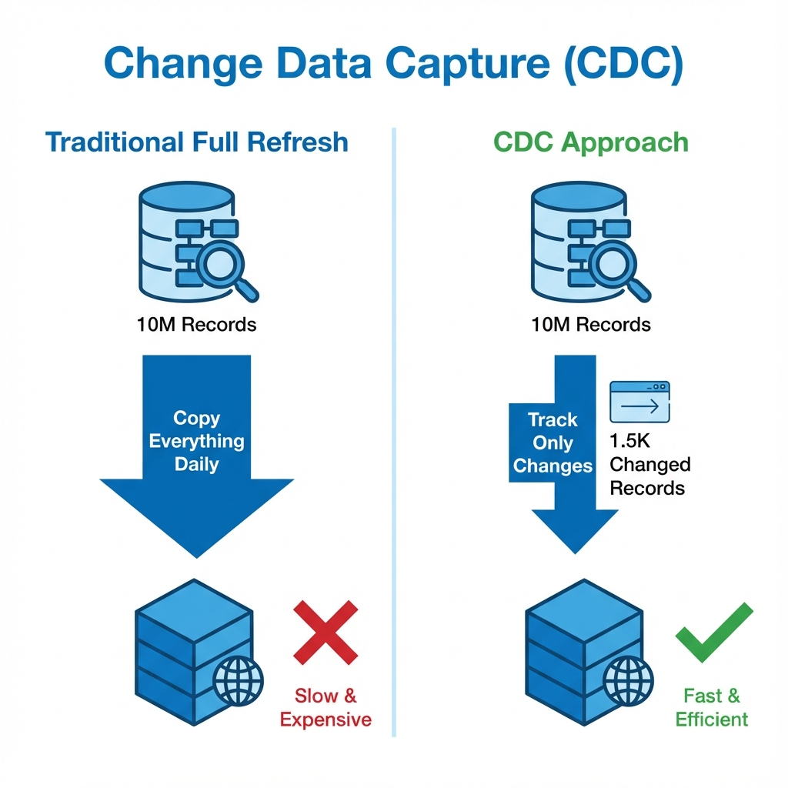
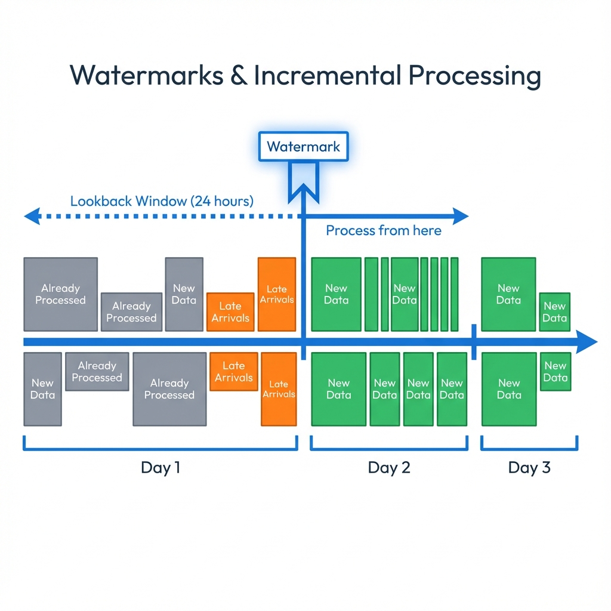
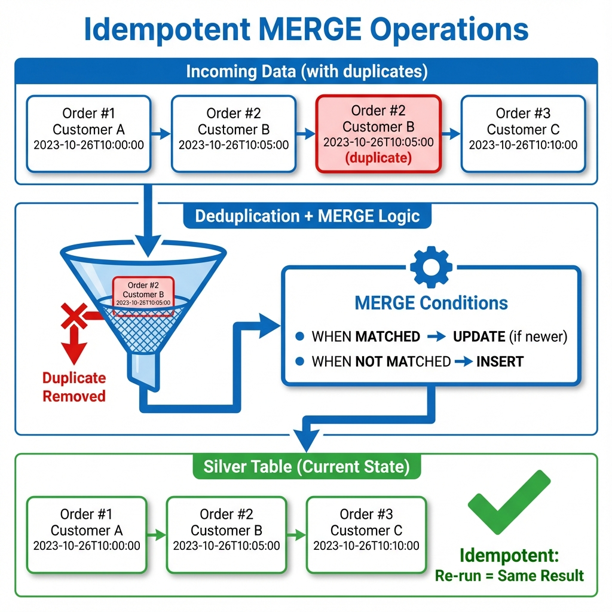

# Week 7: CDC, Idempotency & Incremental Loads
---

## Session Overview

### Learning Objectives
By the end of this session, students will understand:
- ✅ Why incremental processing beats full refresh (cost & speed)
- ✅ How to use watermarks to track pipeline progress
- ✅ How to build idempotent pipelines with Delta MERGE
- ✅ How to handle late-arriving data

### The Business Problem (Hook)
> "Your company processes 10M orders nightly. Full refresh = 4 hours, $800. Incremental = 3 minutes, $5. Let's build that!"

---

## Part 1: The Problem with Full Refresh

### 🎯 Interactive Question
**Ask:** "Who's run a data pipeline that reprocesses everything, even unchanged data?"

### The Cost of Full Refresh
```
E-commerce Company: 10M customer orders
┌─────────────────┬──────────┬──────────┬──────────┐
│ Approach        │ Time     │ Cost     │ Data     │
├─────────────────┼──────────┼──────────┼──────────┤
│ Full Refresh    │ 4 hours  │ $800     │ 10M rows │
│ Incremental CDC │ 3 min    │ $5       │ 1.5K rows│
└─────────────────┴──────────┴──────────┴──────────┘
Savings: 98% cost reduction, 80x faster!
```

### Key Insight
> "Most data doesn't change daily. Why reprocess it?"

---

## Part 2: Three Core Concepts

### Concept 1: Change Data Capture (CDC)

**Simple Definition:**
> "CDC = Tracking what changed instead of copying everything"

**Real-World Analogy:**
- ❌ Bad: Photocopy entire notebook daily
- ✅ Good: Write down only today's changes

**Live Demo Code:**
```python
# Day 1: Initial orders
orders_day1 = spark.createDataFrame([
    (1, "Alice", "pending", "2024-11-24 10:00:00"),
    (2, "Bob", "pending", "2024-11-24 11:00:00")
], ["order_id", "customer", "status", "updated_at"])

# Day 2: Changes only!
orders_day2 = spark.createDataFrame([
    (1, "Alice", "shipped", "2024-11-25 14:00:00"),  # UPDATE
    (3, "Carol", "pending", "2024-11-25 15:00:00")   # INSERT
], ["order_id", "customer", "status", "updated_at"])
```

**Key Takeaway:** "Process only what changed = massive savings"

**Visual Explanation:**



---

### Concept 2: Watermarks & Incremental Loads

**Simple Definition:**
> "Watermark = Your pipeline's bookmark"

**Real-World Analogy:**
- Reading a book series: Remember which book you finished
- Pipeline: Remember which data you processed

**Live Demo Code:**
```python
# Pipeline state table
pipeline_state = spark.createDataFrame([
    ("order_pipeline", "2024-11-24 23:59:59", 1000)
], ["pipeline_name", "last_watermark", "records_processed"])

# Read only NEW data
current_watermark = "2024-11-24 23:59:59"
new_orders = orders.filter(col("updated_at") > current_watermark)

print(f"Processing only {new_orders.count()} new records!")
```

**Handling Late Arrivals:**
```python
# Use lookback window (e.g., 24 hours)
lookback_time = current_watermark - interval(1, "day")
incremental_data = orders.filter(col("updated_at") > lookback_time)
```

**Key Takeaway:** "Watermarks track progress; lookback windows catch late data"

**Visual Explanation:**



---

### Concept 3: Idempotent MERGE

**Simple Definition:**
> "Idempotent = Safe to re-run. Same input → Same output, always."

**Real-World Analogy:**
- Light switch: Flip "on" once or 10 times → Light still on
- Pipeline: Run once or 10 times → Same final state

**Live Demo Code:**
```python
from delta.tables import DeltaTable

# Create Silver table (current state)
silver_orders.write.format("delta").save("/dbfs/user/hive/warehouse/orders_silver")

# Incoming changes (with duplicates!)
incoming = spark.createDataFrame([
    (1, "Alice", "delivered", "2024-11-26 10:00:00"),
    (1, "Alice", "delivered", "2024-11-26 10:00:00"),  # DUPLICATE!
    (4, "David", "pending", "2024-11-26 11:00:00")
], ["order_id", "customer", "status", "updated_at"])

# Deduplicate first
from pyspark.sql.window import Window
deduplicated = incoming.withColumn(
    "rn", row_number().over(Window.partitionBy("order_id").orderBy(col("updated_at").desc()))
).filter(col("rn") == 1).drop("rn")

# MERGE (upsert)
target = DeltaTable.forPath(spark, "/dbfs/user/hive/warehouse/orders_silver")
target.alias("t").merge(
    deduplicated.alias("s"),
    "t.order_id = s.order_id"
).whenMatchedUpdate(
    condition = "s.updated_at > t.updated_at",
    set = {"status": "s.status", "updated_at": "s.updated_at"}
).whenNotMatchedInsert(
    values = {"order_id": "s.order_id", "customer": "s.customer", 
              "status": "s.status", "updated_at": "s.updated_at"}
).execute()
```

**Test Idempotency:**
```python
# Run 1
before = spark.read.format("delta").load("/dbfs/user/hive/warehouse/orders_silver").count()

# Run 2 (same data)
# ... execute MERGE again ...
after = spark.read.format("delta").load("/dbfs/user/hive/warehouse/orders_silver").count()

assert before == after  # ✅ Idempotent!
```

**Key Takeaway:** "MERGE + deduplication = safe re-runs"

**Visual Explanation:**



---

## Part 3: Implementation Guide

### Design Checklist

Before writing any code, plan your pipeline by answering these questions:

**Your Pre-Implementation Checklist:**
- [ ] **What uniquely identifies each record?** (business key)
- [ ] **How will I know if data changed?** (timestamp, version number, or CDC column)
- [ ] **How will I track my progress?** (watermark strategy)
- [ ] **What if data arrives late?** (late-arrival handling)
- [ ] **What if I get conflicting updates?** (conflict resolution rules)
- [ ] **How will I handle duplicates?** (deduplication logic)
- [ ] Design pipeline state table
- [ ] Define validation metrics

### Conflict Resolution Rules

When multiple updates exist for the same business key:

**Rule 1: Latest Timestamp Wins**
```sql
WHEN MATCHED AND source.update_timestamp > target.update_timestamp THEN UPDATE
```

**Rule 2: Highest Version Wins**
```sql
WHEN MATCHED AND source.version > target.version THEN UPDATE
```

**Rule 3: Custom Business Logic**
```sql
WHEN MATCHED AND (
    source.update_timestamp > target.update_timestamp OR
    (source.update_timestamp = target.update_timestamp AND source.priority > target.priority)
) THEN UPDATE
```

### Validation Metrics

Track these metrics for every pipeline run:

| Metric | Purpose | Alert Threshold |
|--------|---------|-----------------|
| `records_read` | Input volume | < 0 (pipeline failure) |
| `records_deduplicated` | Duplicate detection | > 10% of input |
| `records_inserted` | New entities | Sudden spike/drop |
| `records_updated` | Changed entities | Sudden spike/drop |
| `records_deleted` | Removed entities | > 5% of total |
| `execution_duration_sec` | Performance | > 2x historical average |

### Error Handling

**Watermark Update Strategy:**
```python
try:
    # Read incremental data
    incremental_df = read_incremental_data(watermark)
    
    # Deduplicate
    deduplicated_df = deduplicate(incremental_df)
    
    # Merge
    merge_into_target(deduplicated_df)
    
    # Update watermark ONLY after success
    update_watermark(new_watermark)
    
except Exception as e:
    # Do NOT update watermark on failure
    log_error(e)
    raise
```

**Critical Rule:** Never advance the watermark if the pipeline fails.

---

## Part 4: Best Practices

### How to Manage Watermarks Like a Pro

✅ **DO (Follow these rules!):**
- Update your watermark only AFTER everything succeeds (not before!)
- Use database transactions to keep things safe
- Include lookback window for late arrivals
- Monitor watermark lag (current_time - watermark)

❌ **DON'T:**
- Update watermark before processing completes
- Use unreliable timestamps (client-side, unvalidated)
- Skip watermark validation checks
- Ignore watermark lag alerts

### MERGE Performance Optimization
- **Partition pruning:** Align MERGE conditions with table partitioning
- **Z-ordering:** Optimize for business key lookups
- **File compaction:** Run OPTIMIZE regularly
- **Statistics:** Keep table statistics current with ANALYZE TABLE

### Testing Idempotency

**Test Scenario:**
1. Run pipeline with Day 1 data → Record final state
2. Run pipeline with Day 1 data again → Verify identical state
3. Run pipeline with Day 2 data → Record final state
4. Run pipeline with Day 2 data again → Verify identical state

**Validation:**
```sql
-- Compare row counts
SELECT COUNT(*) FROM target_table;

-- Compare checksums
SELECT SUM(HASH(*)) FROM target_table;

-- Compare specific records
SELECT * FROM target_table WHERE business_key = 'test_key';
```

### Monitoring & Alerting

**Key Alerts:**
- Watermark lag exceeds threshold (e.g., > 4 hours)
- Zero records processed (potential upstream issue)
- Abnormal insert/update ratios
- Pipeline duration exceeds SLA
- Duplicate rate exceeds threshold

---

## Part 5: Common Mistakes to Avoid

### Pitfall 1: Trusting Unreliable Timestamps
**The Problem:** Imagine your source system's clock is wrong, or someone manually backdates a record. Your pipeline could miss important updates!

**Real example:** A transaction timestamped "yesterday" arrives today because someone's server clock was wrong.

**Solution:**
- Use database-generated timestamps where possible
- Implement timestamp validation rules
- Add sequence numbers as secondary ordering
- Monitor timestamp anomalies

### Pitfall 2: Missing Deduplication
**Problem:** Duplicate records in source data cause incorrect MERGE behavior

**Solution:**
- Always deduplicate before MERGE
- Log duplicate counts for monitoring
- Investigate root cause of duplicates

### Pitfall 3: Premature Watermark Update
**Problem:** Watermark updated before MERGE completes, causing data loss on retry

**Solution:**
- Use database transactions
- Update watermark as final step
- Implement rollback on failure

### Pitfall 4: Ignoring Late Arrivals
**Problem:** Late-arriving data never gets processed

**Solution:**
- Implement lookback window
- Use MERGE to handle updates regardless of arrival time
- Monitor late-arrival metrics

### Pitfall 5: Non-Idempotent Transformations
**Problem:** Pipeline produces different results on re-run (e.g., using CURRENT_TIMESTAMP)

**Solution:**
- Use deterministic functions only
- Pass execution timestamp as parameter
- Avoid random number generation without seeds

---

## Part 6: Putting It All Together

### The Complete Incremental Pipeline

**Architecture:**
```
Bronze (Raw CDC)  →  Silver (Current State)
     ↓                      ↓
 Watermark            MERGE Logic
 Tracking             (Idempotent)
```

**Live Demo: End-to-End Pipeline**

```python
# Step 1: Read watermark
watermark = spark.read.format("delta").load("/dbfs/user/hive/warehouse/pipeline_state") \
    .select("last_watermark").first()[0]

# Step 2: Read incremental data (with lookback)
lookback = watermark - expr("INTERVAL 1 DAY")
incremental = spark.read.format("delta").load("/dbfs/user/hive/warehouse/orders_bronze") \
    .filter(col("updated_at") > lookback)

# Step 3: Deduplicate
deduplicated = incremental.withColumn(
    "rn", row_number().over(Window.partitionBy("order_id").orderBy(col("updated_at").desc()))
).filter(col("rn") == 1).drop("rn")

# Step 4: MERGE into Silver
target = DeltaTable.forPath(spark, "/dbfs/user/hive/warehouse/orders_silver")
target.alias("t").merge(deduplicated.alias("s"), "t.order_id = s.order_id") \
    .whenMatchedUpdate(condition="s.updated_at > t.updated_at", set={"*"}) \
    .whenNotMatchedInsert(values={"*"}) \
    .execute()

# Step 5: Update watermark (ONLY after success!)
new_watermark = incremental.agg(max("updated_at")).first()[0]
spark.createDataFrame([("order_pipeline", new_watermark, incremental.count())], 
                      ["pipeline_name", "last_watermark", "records_processed"]) \
    .write.format("delta").mode("overwrite").save("/dbfs/user/hive/warehouse/pipeline_state")

print(f"✅ Pipeline complete! Processed {incremental.count()} records")
```

### Common Pitfalls (Quick Tips)

| Pitfall | Solution |
|---------|----------|
| Update watermark too early | Update ONLY after MERGE succeeds |
| Skip deduplication | Always deduplicate before MERGE |
| Ignore late arrivals | Use lookback window (24-48 hours) |
| Unreliable timestamps | Use database-generated timestamps |

---

## Part 7: Your Assignment Preview

### ShopFast E-Commerce Scenario

**You'll build:**
- CDC pipeline for order management system
- Handle Black Friday orders → Processing → Late shipments
- Prove idempotency through re-runs

**Data Volumes:**
- Day 1: 1,000 new orders (Black Friday)
- Day 2: 500 new + 770 updates
- Day 3: 300 new + 560 updates (including 150 late arrivals!)

**Success = 98% cost reduction proof!**

---

**End of Live Session Guide**

**Additional Materials:**
- 💻 [Pre-built Demo Notebook](Week7_Live_Demo_Notebook.py)
- 📖 [Technical Documentation](Week7_Technical_Documentation.md)

