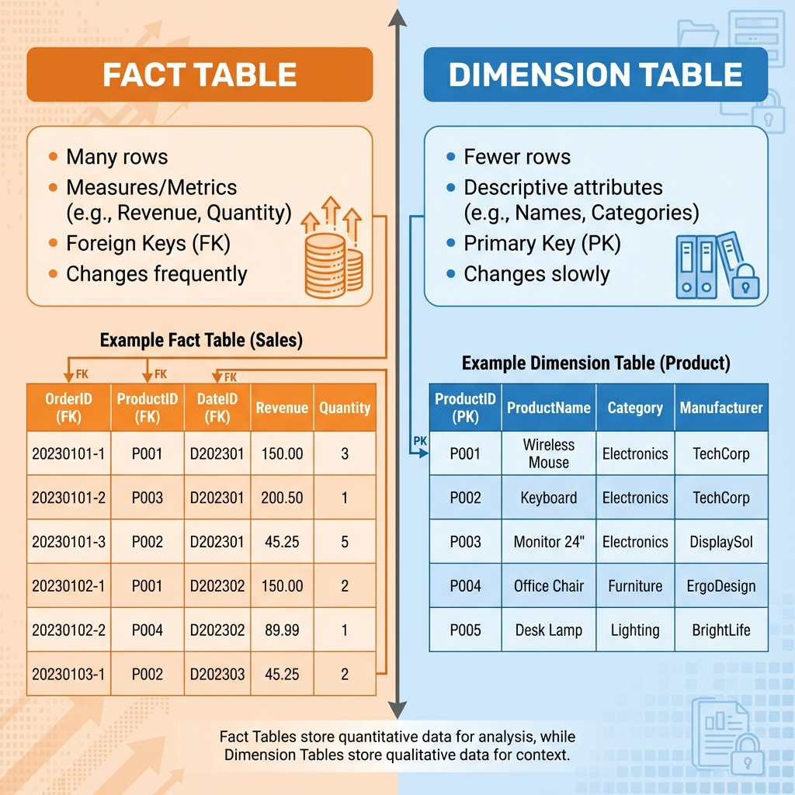
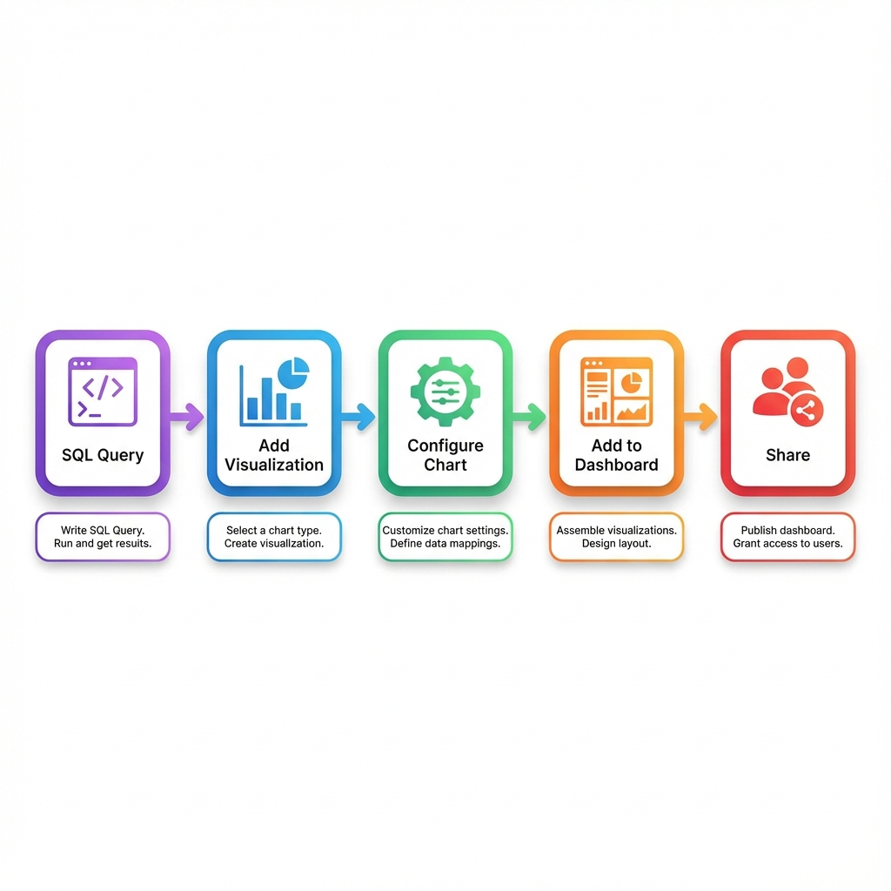
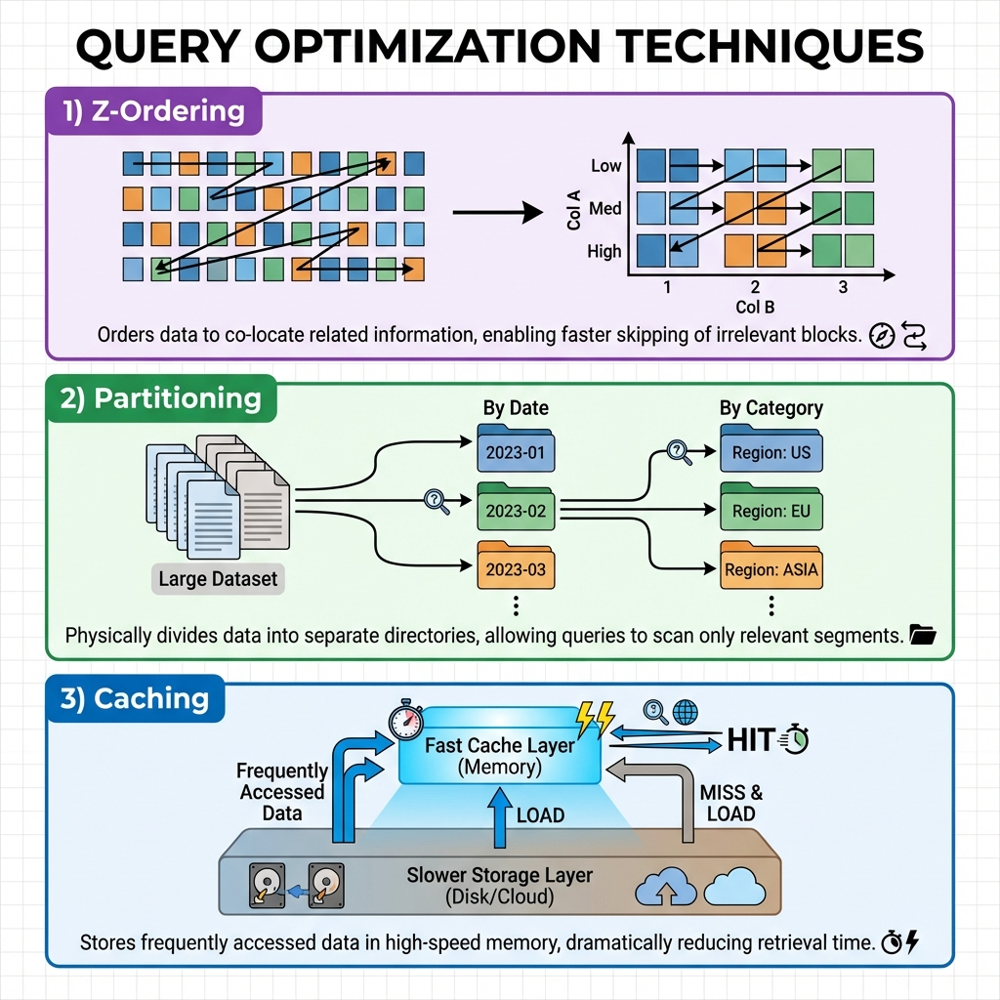

# 📊 Week 8 Live Session: Data Warehousing & BI Integration
**Clogenai Academy – Data Pipeline Engineering Track**  

---

## 🎯 Session Overview

**Objective**: Learn to build analytics-ready data models and deliver insights through interactive dashboards.

**What Students Will Build**: A sales analytics solution from Gold-layer tables to dashboards.

---

## 📚 Topic 1: Gold-Layer Data Modeling

### **What is the Gold Layer?**

The **Gold layer** is the final stage in the Medallion Architecture where data is:
- ✅ **Analytics-ready**: Optimized for BI tools and dashboards
- ✅ **Business-aligned**: Structured around business concepts
- ✅ **Performant**: Optimized for fast queries
- ✅ **Trusted**: Validated and high-quality

### **Medallion Architecture Overview**

**Key Layers**:
- **Bronze**: Raw data as-is from sources (JSON, CSV, APIs)
- **Silver**: Cleaned, validated, enriched data
- **Gold**: Business-level aggregates, facts, and dimensions

---

### **Fact vs Dimension Tables**

#### Understanding the Star Schema

The Gold layer uses a **star schema** with:
- **Fact tables**: Store measurable business events
- **Dimension tables**: Provide context for facts



#### Fact Tables

**Characteristics**:
- 📊 Store **metrics/measures** (revenue, quantity, duration)
- 🔑 Contain **foreign keys** to dimensions
- 📈 Typically have **many rows** (high cardinality)
- ⚡ **Change frequently** (new transactions daily)

**Example: `fact_sales`**
```sql
CREATE TABLE gold.fact_sales (
    order_id        STRING,
    customer_id     STRING,      -- FK to dim_customer
    product_id      STRING,      -- FK to dim_product
    order_date      DATE,        -- FK to dim_date
    quantity        INT,         -- Measure
    revenue         DECIMAL,     -- Measure
    profit          DECIMAL      -- Measure
);
```

**Grain**: One row per order line item

#### Dimension Tables

**Characteristics**:
- 📝 Store **descriptive attributes** (names, categories, locations)
- 🔑 Have a **primary key**
- 📉 Relatively **fewer rows** (lower cardinality)
- 🐌 **Change slowly** (product names don't change often)

**Example: `dim_product`**
```sql
CREATE TABLE gold.dim_product (
    product_id      STRING PRIMARY KEY,
    product_name    STRING,
    category        STRING,
    subcategory     STRING,
    brand           STRING,
    price           DECIMAL
);
```

---

### **Live Demo: Creating Gold Tables**

**See Databricks Notebook**: `week8_live_demo.ipynb`

**What We'll Build**:
1. Create `dim_product` dimension table
2. Create `fact_sales` fact table
3. Join fact and dimension to analyze sales

---

## 📚 Topic 2: Business Analytics Queries

### **Writing SQL for Business Questions**

#### Query 1: Sales KPIs

**Business Question**: "What are our key sales metrics?"

```sql
SELECT 
    COUNT(DISTINCT order_id) AS total_orders,
    SUM(line_total) AS total_revenue,
    AVG(line_total) AS avg_order_value,
    SUM(profit) AS total_profit,
    (SUM(profit) / SUM(line_total)) * 100 AS profit_margin_pct
FROM gold.fact_sales
WHERE order_date >= '2024-01-01';
```

#### Query 2: Revenue by Category

**Business Question**: "Which product categories perform best?"

```sql
SELECT 
    p.category,
    COUNT(DISTINCT f.order_id) AS order_count,
    SUM(f.line_total) AS total_revenue,
    AVG(f.line_total) AS avg_order_value
FROM gold.fact_sales f
JOIN gold.dim_product p ON f.product_id = p.product_id
GROUP BY p.category
ORDER BY total_revenue DESC;
```

#### Query 3: Monthly Sales Trend

**Business Question**: "How are sales trending month-over-month?"

```sql
WITH monthly_sales AS (
    SELECT 
        DATE_TRUNC('month', order_date) AS month,
        SUM(line_total) AS revenue
    FROM gold.fact_sales
    GROUP BY DATE_TRUNC('month', order_date)
)
SELECT 
    month,
    revenue,
    LAG(revenue) OVER (ORDER BY month) AS prev_month_revenue,
    ((revenue - LAG(revenue) OVER (ORDER BY month)) / 
     LAG(revenue) OVER (ORDER BY month) * 100) AS growth_pct
FROM monthly_sales
ORDER BY month;
```

---

## 📚 Topic 3: Building Databricks Dashboards

### **What are Databricks Dashboards?**

- Native visualization in Databricks SQL
- No external tools needed
- Interactive and shareable



**Dashboard Creation Workflow**:
1. Write SQL query
2. Add visualization
3. Configure chart type
4. Add to dashboard
5. Share with stakeholders

---

### Building a Sales Dashboard**

**What We'll Create**:

1. **KPI Counter**: Total Revenue
2. **KPI Counter**: Total Orders
3. **Bar Chart**: Revenue by Category
4. **Line Chart**: Monthly Revenue Trend
5. **Table**: Top 10 Products

**Dashboard Layout**:
```
+------------------+------------------+------------------+
|  Total Revenue   |  Total Orders    |  Avg Order Value |
|    (Counter)     |   (Counter)      |    (Counter)     |
+------------------+------------------+------------------+
|                                                        |
|           Monthly Revenue Trend (Line Chart)          |
|                                                        |
+------------------+------------------+------------------+
|  Revenue by      |                                    |
|  Category        |     Top 10 Products (Table)        |
|  (Bar Chart)     |                                    |
+------------------+------------------+------------------+
```

**📋 See detailed layout guide**: `dashboard_layout_reference.md`

---

## 💡 Best Practices

### **Data Modeling**

✅ **Define Clear Grain**: Every fact table should have well-defined grain  
✅ **Use Meaningful Names**: Business-friendly column names  
✅ **Add Calculated Fields**: Pre-calculate common metrics  

### **Query Optimization**



✅ **Z-Ordering**: Optimize for common filter columns
```sql
OPTIMIZE gold.fact_sales ZORDER BY (order_date, product_id);
```

✅ **Aggregated Tables**: Pre-aggregate for dashboards
```sql
CREATE TABLE gold.agg_daily_sales AS
SELECT 
    order_date,
    SUM(line_total) AS daily_revenue,
    COUNT(DISTINCT order_id) AS daily_orders
FROM gold.fact_sales
GROUP BY order_date;
```

### **Dashboard Design**

✅ **Visual Hierarchy**: Most important metrics at top  
✅ **Consistent Colors**: Use color scheme throughout  
✅ **Clear Labels**: Self-explanatory titles and axis labels  
✅ **Limit Clutter**: 5-7 visualizations per dashboard  

---

## 🎯 Key Takeaways

**Today You Learned**:
1. ✅ Gold-layer data modeling (facts and dimensions)
2. ✅ Writing business analytics queries
3. ✅ Building interactive Databricks dashboards

**Questions? Let's discuss! 💬**

---

*Clogenai Academy – Data Pipeline Engineering Track*  
*Week 8 Session*  
*Version 2.0 – December 2025*
