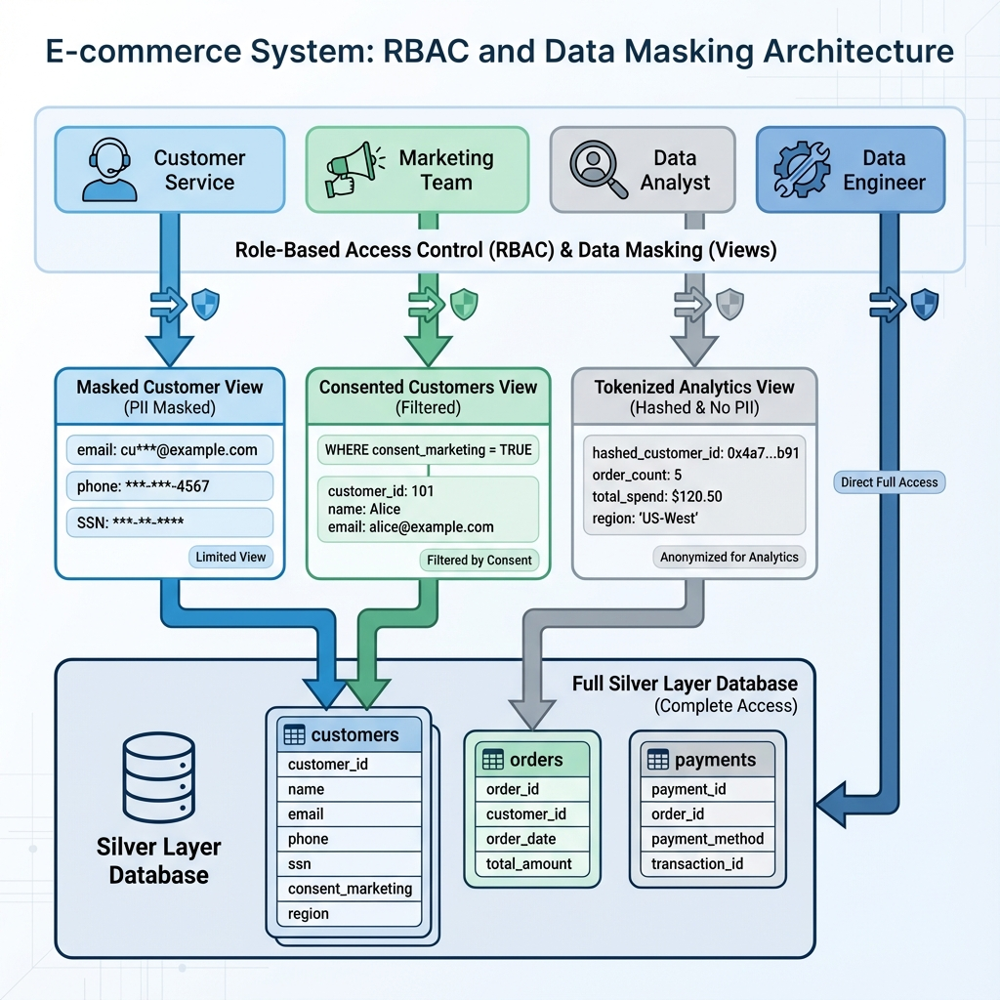
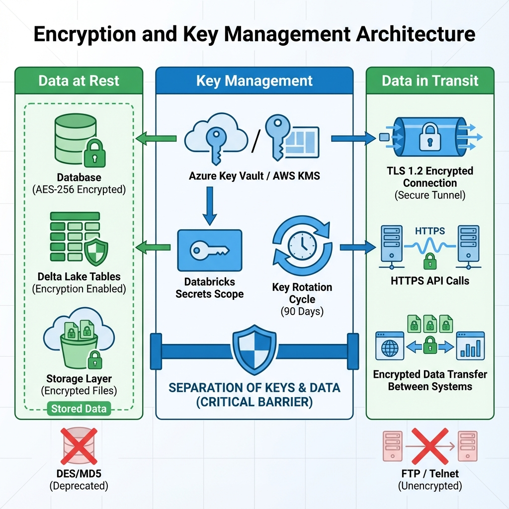
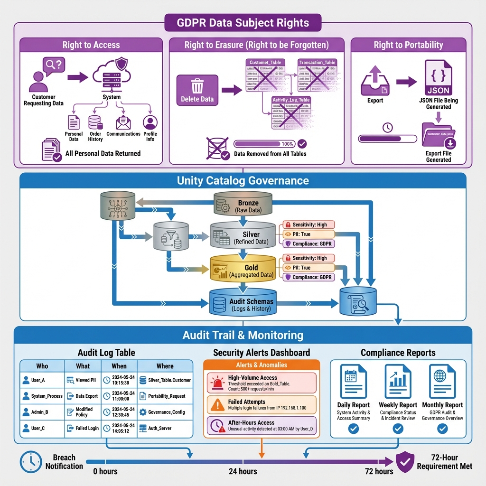

# 🔒 Week 9 Live Session: Data Governance & Security
**Clogenai Academy – Data Pipeline Engineering Track**  

---

## 🎯 Session Overview

### Learning Objectives
By the end of this session, students will understand:
- ✅ How to implement Role-Based Access Control (RBAC) in Databricks
- ✅ Techniques for data masking and tokenization to protect sensitive data
- ✅ Encryption strategies for data at rest and in transit
- ✅ Key management best practices
- ✅ GDPR and HIPAA compliance requirements
- ✅ Unity Catalog for centralized governance
- ✅ Implementing comprehensive audit trails

### The Business Problem (Hook)
> "Your company handles 50M customer records with PII. A data breach costs $4.5M on average. One misconfigured permission = regulatory fines + reputation damage. Let's build enterprise-grade security!"

---

## Part 1: The Cost of Poor Data Governance

### 🎯 Interactive Question
**Ask:** "Who's worked with sensitive data like SSNs, credit cards, or health records?"

### The Real Cost of Data Breaches

```
Healthcare Company: 10M patient records
┌─────────────────────┬──────────────┬──────────────┐
│ Security Measure    │ Cost         │ Breach Risk  │
├─────────────────────┼──────────────┼──────────────┤
│ No Governance       │ $0           │ 85% chance   │
│ Basic Controls      │ $50K/year    │ 40% chance   │
│ Enterprise Security │ $200K/year   │ 5% chance    │
└─────────────────────┴──────────────┴──────────────┘

Average Breach Cost: $4.5M
GDPR Fine: Up to 4% of annual revenue
HIPAA Fine: Up to $1.5M per violation
```

### Key Insight
> "Security isn't optional—it's a business requirement. The question isn't 'Can we afford security?' but 'Can we afford NOT to have it?'"

---

## Part 2: Three Core Concepts

### Concept 1: Access Control & Data Protection

**Simple Definition:**
> "RBAC = Right person, right data, right access level. Nothing more, nothing less."

**Real-World Analogy:**
- ❌ Bad: Everyone has master key to entire building
- ✅ Good: Security badges grant access only to authorized areas

#### Role-Based Access Control (RBAC)

**Live Demo Code:**
```sql
-- Create roles with different access levels
CREATE ROLE data_analyst;
CREATE ROLE data_engineer;
CREATE ROLE data_admin;

-- Grant read-only access to analysts
GRANT SELECT ON TABLE academy.gold.customer_analytics TO data_analyst;

-- Grant read/write to engineers
GRANT SELECT, INSERT, UPDATE ON TABLE academy.silver.customers TO data_engineer;

-- Grant full control to admins
GRANT ALL PRIVILEGES ON SCHEMA academy.gold TO data_admin;

-- Assign users to roles
GRANT data_analyst TO `analyst@company.com`;
GRANT data_engineer TO `engineer@company.com`;
```

#### Data Masking

**Simple Definition:**
> "Data masking = Show only what's needed. Hide the rest."

**Live Demo Code:**
```sql
-- Create a view with masked PII
CREATE OR REPLACE VIEW academy.gold.customers_masked AS
SELECT 
    customer_id,
    -- Mask email: show only domain
    CONCAT('***@', SPLIT(email, '@')[1]) AS email_masked,
    -- Mask phone: show only last 4 digits
    CONCAT('***-***-', RIGHT(phone, 4)) AS phone_masked,
    -- Mask SSN completely
    '***-**-****' AS ssn_masked,
    -- Keep non-sensitive fields
    first_name,
    last_name,
    city,
    state
FROM academy.silver.customers;

-- Analysts see masked data
GRANT SELECT ON VIEW academy.gold.customers_masked TO data_analyst;

-- Engineers see full data (when authorized)
GRANT SELECT ON TABLE academy.silver.customers TO data_engineer;
```

#### Data Tokenization

**Simple Definition:**
> "Tokenization = Replace sensitive data with random tokens. Store mapping securely."

**Live Demo Code:**
```python
from pyspark.sql.functions import sha2, concat_ws, lit
import uuid

# Create tokenized customer data
def tokenize_pii(df):
    return df.withColumn(
        "customer_token",
        sha2(concat_ws("|", col("customer_id"), lit(str(uuid.uuid4()))), 256)
    ).withColumn(
        "email_token",
        sha2(col("email"), 256)
    ).select(
        "customer_token",
        "email_token",
        "first_name",
        "last_name",
        "city",
        "state"
        # Original PII fields removed
    )

# Apply tokenization
tokenized_customers = tokenize_pii(customers_df)

# Store token mapping separately (in secure vault)
token_mapping = customers_df.select(
    "customer_id",
    sha2(concat_ws("|", col("customer_id"), lit(str(uuid.uuid4()))), 256).alias("customer_token"),
    "email",
    "ssn"
)
```

**Key Takeaway:** "Layer your security: RBAC controls who sees what, masking hides sensitive parts, tokenization removes PII entirely."

**Visual Explanation:**



---

### Concept 2: Encryption & Key Management

**Simple Definition:**
> "Encryption = Lock your data. Only authorized keys can unlock it."

**Real-World Analogy:**
- Encryption at rest = Safe deposit box (data stored securely)
- Encryption in transit = Armored truck (data moving securely)
- Key management = Bank vault for the keys

#### Encryption at Rest

**Live Demo Code:**
```sql
-- Enable encryption for Delta tables
CREATE TABLE academy.silver.customers_encrypted (
    customer_id STRING,
    email STRING,
    ssn STRING,
    created_at TIMESTAMP
)
USING DELTA
LOCATION 'abfss://container@storage.dfs.core.windows.net/customers'
TBLPROPERTIES (
    'delta.encryption.enabled' = 'true',
    'delta.encryption.algorithm' = 'AES-256'
);

-- Verify encryption status
DESCRIBE EXTENDED academy.silver.customers_encrypted;
```

#### Encryption in Transit

**Configuration:**
```python
# Databricks cluster configuration
spark.conf.set("spark.ssl.enabled", "true")
spark.conf.set("spark.ssl.protocol", "TLSv1.2")

# Azure Storage with encryption in transit
spark.conf.set(
    "fs.azure.account.key.mystorageaccount.dfs.core.windows.net",
    dbutils.secrets.get(scope="azure-secrets", key="storage-key")
)

# All data transfers use HTTPS
df = spark.read.format("delta") \
    .load("abfss://container@storage.dfs.core.windows.net/data")
```

#### Key Management Best Practices

**Live Demo Code:**
```python
# NEVER hardcode secrets!
# ❌ BAD
api_key = "sk-1234567890abcdef"

# ✅ GOOD: Use Databricks Secrets
api_key = dbutils.secrets.get(scope="production", key="api-key")

# Create secret scope (one-time setup)
# databricks secrets create-scope --scope production

# Add secrets to scope
# databricks secrets put --scope production --key api-key

# List available scopes
dbutils.secrets.listScopes()

# Use secrets in code
storage_account_key = dbutils.secrets.get(
    scope="azure-secrets",
    key="storage-account-key"
)

spark.conf.set(
    f"fs.azure.account.key.{storage_account}.dfs.core.windows.net",
    storage_account_key
)
```

#### Key Rotation Strategy

**Best Practices:**
```python
# Implement key rotation policy
# 1. Generate new key
# 2. Re-encrypt data with new key
# 3. Deprecate old key after grace period
# 4. Audit key usage

def rotate_encryption_key(table_path, old_key_version, new_key_version):
    """
    Rotate encryption keys for Delta table
    """
    # Read with old key
    df = spark.read.format("delta") \
        .option("encryption.key.version", old_key_version) \
        .load(table_path)
    
    # Write with new key
    df.write.format("delta") \
        .option("encryption.key.version", new_key_version) \
        .mode("overwrite") \
        .save(table_path)
    
    # Log rotation event
    log_key_rotation(table_path, old_key_version, new_key_version)
```

**Key Takeaway:** "Encrypt everything: data at rest, data in transit. Manage keys like crown jewels—use secret vaults, rotate regularly, audit access."

**Visual Explanation:**



---

### Concept 3: Compliance & Audit Trails

**Simple Definition:**
> "Compliance = Following the rules. Audit trails = Proving you followed them."

**Real-World Analogy:**
- GDPR/HIPAA = Traffic laws
- Audit trails = Dashcam footage proving you obeyed them

#### Understanding GDPR & HIPAA

**GDPR (General Data Protection Regulation)**

**Key Requirements:**
- ✅ **Right to Access**: Users can request their data
- ✅ **Right to Erasure**: Users can request deletion ("right to be forgotten")
- ✅ **Data Portability**: Users can export their data
- ✅ **Consent Management**: Track and honor user consent
- ✅ **Breach Notification**: Report breaches within 72 hours

**Live Demo Code:**
```sql
-- GDPR: Right to Access
-- User requests: "Show me all my data"
SELECT *
FROM academy.gold.customer_data
WHERE customer_id = '12345'
AND consent_marketing = TRUE;

-- GDPR: Right to Erasure
-- User requests: "Delete all my data"
DELETE FROM academy.silver.customers
WHERE customer_id = '12345';

-- Cascade deletion across all tables
DELETE FROM academy.silver.orders WHERE customer_id = '12345';
DELETE FROM academy.silver.customer_preferences WHERE customer_id = '12345';

-- Log deletion for audit
INSERT INTO academy.audit.gdpr_deletions
VALUES ('12345', current_timestamp(), 'user_request', 'completed');

-- GDPR: Data Portability
-- Export user data in portable format
SELECT *
FROM academy.gold.customer_complete_profile
WHERE customer_id = '12345'
-- Export as JSON for portability
```

**HIPAA (Health Insurance Portability and Accountability Act)**

**Key Requirements:**
- ✅ **PHI Protection**: Safeguard Protected Health Information
- ✅ **Access Controls**: Strict RBAC for medical data
- ✅ **Audit Logging**: Track all PHI access
- ✅ **Encryption**: Encrypt PHI at rest and in transit
- ✅ **Minimum Necessary**: Access only what's needed

**Live Demo Code:**
```sql
-- HIPAA: Minimum Necessary Principle
-- Create role-specific views
CREATE OR REPLACE VIEW academy.gold.patient_billing AS
SELECT 
    patient_id,
    billing_code,
    amount,
    insurance_provider
    -- NO medical diagnosis or treatment details
FROM academy.silver.patient_records
WHERE is_active = TRUE;

GRANT SELECT ON VIEW academy.gold.patient_billing TO billing_staff;

-- Medical staff get full access
CREATE OR REPLACE VIEW academy.gold.patient_medical AS
SELECT 
    patient_id,
    diagnosis,
    treatment_plan,
    medications,
    doctor_notes
FROM academy.silver.patient_records;

GRANT SELECT ON VIEW academy.gold.patient_medical TO medical_staff;
```

#### Unity Catalog for Centralized Governance

**Simple Definition:**
> "Unity Catalog = Single source of truth for all your data governance needs"

**Key Features:**
- 🔐 Centralized access control
- 📊 Data lineage tracking
- 🏷️ Metadata management
- 🔍 Data discovery
- 📝 Audit logging

**Live Demo Code:**
```sql
-- Create catalog hierarchy
CREATE CATALOG IF NOT EXISTS academy;
CREATE SCHEMA IF NOT EXISTS academy.bronze;
CREATE SCHEMA IF NOT EXISTS academy.silver;
CREATE SCHEMA IF NOT EXISTS academy.gold;

-- Set catalog-level permissions
GRANT USE CATALOG ON CATALOG academy TO data_analyst;
GRANT USE SCHEMA ON SCHEMA academy.gold TO data_analyst;

-- Create managed table in Unity Catalog
CREATE TABLE academy.silver.customers (
    customer_id STRING NOT NULL,
    email STRING,
    created_at TIMESTAMP,
    updated_at TIMESTAMP
)
USING DELTA
COMMENT 'Customer master data - PII protected';

-- Add column-level tags for governance
ALTER TABLE academy.silver.customers 
ALTER COLUMN email SET TAGS ('pii' = 'email', 'sensitivity' = 'high');

-- Query data lineage
DESCRIBE EXTENDED academy.silver.customers;

-- View table metadata
SELECT * FROM system.information_schema.tables
WHERE table_catalog = 'academy'
AND table_schema = 'silver';
```

#### Implementing Comprehensive Audit Trails

**Live Demo Code:**
```sql
-- Create audit log table
CREATE TABLE academy.audit.data_access_log (
    audit_id STRING,
    user_email STRING,
    action_type STRING,  -- SELECT, INSERT, UPDATE, DELETE
    table_name STRING,
    row_count BIGINT,
    timestamp TIMESTAMP,
    ip_address STRING,
    query_text STRING
)
USING DELTA
PARTITIONED BY (DATE(timestamp));

-- Enable audit logging for sensitive tables
ALTER TABLE academy.silver.customers 
SET TBLPROPERTIES ('delta.enableChangeDataFeed' = 'true');

-- Query audit logs
SELECT 
    user_email,
    action_type,
    table_name,
    COUNT(*) AS access_count,
    MIN(timestamp) AS first_access,
    MAX(timestamp) AS last_access
FROM academy.audit.data_access_log
WHERE DATE(timestamp) = CURRENT_DATE()
AND table_name LIKE '%customers%'
GROUP BY user_email, action_type, table_name
ORDER BY access_count DESC;

-- Detect suspicious activity
SELECT 
    user_email,
    COUNT(DISTINCT table_name) AS tables_accessed,
    SUM(row_count) AS total_rows_accessed
FROM academy.audit.data_access_log
WHERE timestamp >= CURRENT_TIMESTAMP() - INTERVAL 1 HOUR
GROUP BY user_email
HAVING total_rows_accessed > 100000  -- Alert threshold
ORDER BY total_rows_accessed DESC;
```

**Automated Audit Reports:**
```python
from pyspark.sql.functions import col, count, sum, window

# Generate daily compliance report
def generate_compliance_report(date):
    audit_df = spark.read.table("academy.audit.data_access_log") \
        .filter(col("timestamp").cast("date") == date)
    
    # Access summary by user
    user_summary = audit_df.groupBy("user_email", "action_type") \
        .agg(
            count("*").alias("operation_count"),
            sum("row_count").alias("total_rows")
        )
    
    # Sensitive table access
    sensitive_access = audit_df.filter(
        col("table_name").contains("customers") |
        col("table_name").contains("patient")
    ).groupBy("user_email", "table_name") \
        .agg(count("*").alias("access_count"))
    
    # Failed access attempts (from system logs)
    # ... additional monitoring ...
    
    return {
        "user_summary": user_summary,
        "sensitive_access": sensitive_access,
        "report_date": date
    }

# Run daily
report = generate_compliance_report("2024-12-28")
report["user_summary"].write.format("delta") \
    .mode("append") \
    .save("academy.audit.daily_compliance_reports")
```

**Key Takeaway:** "Compliance isn't just checkboxes—it's protecting people's privacy. Unity Catalog centralizes governance, audit trails prove compliance, and automation ensures nothing slips through."

**Visual Explanation:**



---

## Part 3: Implementation Guide

### Security Checklist

Before implementing data governance, answer these questions:

**Your Pre-Implementation Checklist:**
- [ ] **What data is sensitive?** (PII, PHI, financial data)
- [ ] **Who needs access?** (define roles and responsibilities)
- [ ] **What level of access?** (read-only, read-write, admin)
- [ ] **Which regulations apply?** (GDPR, HIPAA, CCPA, SOC2)
- [ ] **How will you encrypt data?** (at rest and in transit)
- [ ] **Where will you store keys?** (secret management strategy)
- [ ] **How will you track access?** (audit logging requirements)
- [ ] **What's your incident response plan?** (breach notification process)

### Unity Catalog Setup

**Step-by-Step Implementation:**

```sql
-- 1. Create catalog structure
CREATE CATALOG IF NOT EXISTS academy;
USE CATALOG academy;

-- 2. Create schemas for each layer
CREATE SCHEMA IF NOT EXISTS bronze COMMENT 'Raw data landing zone';
CREATE SCHEMA IF NOT EXISTS silver COMMENT 'Cleaned and validated data';
CREATE SCHEMA IF NOT EXISTS gold COMMENT 'Business-ready analytics';
CREATE SCHEMA IF NOT EXISTS audit COMMENT 'Audit and compliance logs';

-- 3. Create service principals for automation
CREATE SERVICE PRINCIPAL 'etl-pipeline-prod';
CREATE SERVICE PRINCIPAL 'reporting-service';

-- 4. Define roles
CREATE ROLE data_analyst;
CREATE ROLE data_engineer;
CREATE ROLE data_scientist;
CREATE ROLE compliance_officer;

-- 5. Grant catalog-level permissions
GRANT USE CATALOG ON CATALOG academy TO data_analyst;
GRANT USE CATALOG ON CATALOG academy TO data_engineer;
GRANT USE CATALOG ON CATALOG academy TO compliance_officer;

-- 6. Grant schema-level permissions
-- Analysts: read-only on gold
GRANT USE SCHEMA ON SCHEMA academy.gold TO data_analyst;
GRANT SELECT ON SCHEMA academy.gold TO data_analyst;

-- Engineers: read-write on silver
GRANT USE SCHEMA ON SCHEMA academy.silver TO data_engineer;
GRANT SELECT, MODIFY ON SCHEMA academy.silver TO data_engineer;

-- Compliance: read-only on audit
GRANT USE SCHEMA ON SCHEMA academy.audit TO compliance_officer;
GRANT SELECT ON SCHEMA academy.audit TO compliance_officer;

-- 7. Assign users to roles
GRANT data_analyst TO `analyst@company.com`;
GRANT data_engineer TO `engineer@company.com`;
GRANT compliance_officer TO `compliance@company.com`;
```

### Data Masking Patterns

**Pattern 1: Dynamic Data Masking**
```sql
-- Create masking function
CREATE OR REPLACE FUNCTION mask_email(email STRING)
RETURNS STRING
RETURN CONCAT(
    LEFT(SPLIT(email, '@')[0], 2),
    '***@',
    SPLIT(email, '@')[1]
);

-- Apply in view
CREATE OR REPLACE VIEW academy.gold.customers_public AS
SELECT 
    customer_id,
    mask_email(email) AS email,
    first_name,
    last_name
FROM academy.silver.customers;
```

**Pattern 2: Column-Level Security**
```sql
-- Requires Databricks Premium/Enterprise
ALTER TABLE academy.silver.customers
ALTER COLUMN ssn SET MASK mask_ssn;

-- Define mask function
CREATE FUNCTION mask_ssn(ssn STRING)
RETURNS STRING
RETURN CASE 
    WHEN is_member('pii_authorized') THEN ssn
    ELSE '***-**-****'
END;
```

### Encryption Configuration

**Azure Databricks:**
```python
# Configure customer-managed keys (CMK)
spark.conf.set("spark.databricks.encryption.enabled", "true")
spark.conf.set("spark.databricks.encryption.keyVaultUri", 
               "https://myvault.vault.azure.net/")

# Enable encryption for workspace storage
# (Configured at workspace level via Azure Portal)
```

**AWS Databricks:**
```python
# Configure KMS encryption
spark.conf.set("spark.databricks.encryption.enabled", "true")
spark.conf.set("spark.databricks.encryption.kms.keyId", 
               "arn:aws:kms:us-east-1:123456789:key/abc-123")
```

---

## Part 4: Best Practices

### Access Control Best Practices

✅ **DO:**
- Implement principle of least privilege
- Use groups/roles instead of individual user grants
- Regularly review and audit permissions
- Automate access provisioning/deprovisioning
- Document all access decisions

❌ **DON'T:**
- Grant broad permissions "just in case"
- Use shared accounts or service principals
- Hardcode credentials in code
- Skip access reviews
- Grant production access to everyone

### Encryption Best Practices

✅ **DO:**
- Encrypt all sensitive data at rest
- Use TLS 1.2+ for data in transit
- Rotate encryption keys regularly (every 90 days)
- Use customer-managed keys (CMK) for sensitive workloads
- Test encryption/decryption in disaster recovery scenarios

❌ **DON'T:**
- Store encryption keys with encrypted data
- Use deprecated encryption algorithms (DES, MD5)
- Skip key rotation
- Hardcode encryption keys
- Assume cloud provider encryption is enough

### Compliance Best Practices

✅ **DO:**
- Maintain comprehensive audit logs (minimum 1 year retention)
- Automate compliance reporting
- Implement data retention policies
- Document all data processing activities
- Train team on compliance requirements
- Conduct regular compliance audits

❌ **DON'T:**
- Delete audit logs prematurely
- Ignore compliance requirements until audit time
- Process data without legal basis
- Skip data classification
- Assume compliance is "IT's problem"

### Audit Trail Best Practices

✅ **DO:**
- Log all data access (who, what, when, where)
- Include query text in audit logs
- Partition audit logs by date for performance
- Set up alerts for suspicious activity
- Retain logs per regulatory requirements
- Make logs immutable (append-only)

❌ **DON'T:**
- Log sensitive data in audit trails
- Allow users to modify audit logs
- Skip logging for "internal" access
- Ignore audit log alerts
- Store audit logs in same location as data

---

## Part 5: Common Mistakes to Avoid

### Pitfall 1: Over-Permissioning
**The Problem:** Granting broad access "to make things easier" creates security risks.

**Real Example:** Analyst granted MODIFY on production tables "temporarily" for a project. Access never revoked. Six months later, accidental DELETE wipes critical data.

**Solution:**
- Start with minimal permissions
- Grant additional access only when justified
- Set expiration dates on temporary access
- Automate access reviews

### Pitfall 2: Ignoring Data Classification
**Problem:** Treating all data the same—no distinction between public and sensitive.

**Solution:**
```sql
-- Tag tables by sensitivity
ALTER TABLE academy.silver.customers 
SET TAGS ('sensitivity' = 'high', 'pii' = 'true', 'compliance' = 'gdpr');

ALTER TABLE academy.gold.sales_summary 
SET TAGS ('sensitivity' = 'low', 'pii' = 'false');

-- Query by classification
SELECT table_name, tag_value
FROM system.information_schema.table_tags
WHERE tag_name = 'sensitivity'
AND tag_value = 'high';
```

### Pitfall 3: Weak Key Management
**Problem:** Storing encryption keys insecurely or not rotating them.

**Solution:**
- Use dedicated secret management (Azure Key Vault, AWS Secrets Manager)
- Implement automated key rotation
- Separate key management from data access
- Audit key usage

### Pitfall 4: Insufficient Audit Logging
**Problem:** Not logging enough detail to investigate incidents.

**Solution:**
```python
# Comprehensive audit logging
def log_data_access(user, action, table, row_count, query):
    audit_entry = {
        "audit_id": str(uuid.uuid4()),
        "user_email": user,
        "action_type": action,
        "table_name": table,
        "row_count": row_count,
        "timestamp": datetime.now(),
        "ip_address": get_client_ip(),
        "query_text": query,
        "session_id": get_session_id()
    }
    
    spark.createDataFrame([audit_entry]) \
        .write.format("delta") \
        .mode("append") \
        .save("academy.audit.data_access_log")
```

### Pitfall 5: Compliance as Afterthought
**Problem:** Building pipelines first, thinking about compliance later.

**Solution:**
- Design with compliance from day one
- Include compliance requirements in planning
- Automate compliance checks in CI/CD
- Regular compliance training for team

---

## Part 6: Putting It All Together

### The Complete Governance Architecture

**Architecture:**
```
Unity Catalog (Governance Layer)
    ↓
┌─────────────┬─────────────┬─────────────┐
│   Bronze    │   Silver    │    Gold     │
│  (Raw Data) │ (Cleaned)   │ (Analytics) │
└─────────────┴─────────────┴─────────────┘
    ↓              ↓              ↓
  RBAC         Encryption      Masking
    ↓              ↓              ↓
        Audit Trails (All Layers)
```

### Live Demo: End-to-End Secure Pipeline

**See Databricks Notebook**: `week9_live_demo.py`

**What We'll Build:**
1. Set up Unity Catalog with proper RBAC
2. Create encrypted tables with masked views
3. Implement audit logging
4. Generate compliance reports
5. Demonstrate GDPR data deletion

---

## Part 7: Your Assignment Preview

### HealthTech Compliance Scenario

**You'll build:**
- Secure patient data pipeline with HIPAA compliance
- Implement RBAC for different user roles
- Create masked views for non-medical staff
- Set up comprehensive audit trails
- Generate compliance reports

**Compliance Requirements:**
- Encrypt all PHI (Protected Health Information)
- Implement minimum necessary access
- Log all data access for 7 years
- Support patient data export (portability)
- Enable secure data deletion

**Success = Zero compliance violations + complete audit trail!**

---

**End of Live Session Guide**

**Additional Materials:**
- 💻 [Pre-built Demo Notebook](week9_live_demo.py)
- 📖 [Unity Catalog Documentation](https://docs.databricks.com/data-governance/unity-catalog/index.html)
- 🔒 [Security Best Practices Guide](https://docs.databricks.com/security/index.html)

---

*Clogenai Academy – Data Pipeline Engineering Track*  
*Week 9 Session*  
*Version 1.0 – December 2024*
